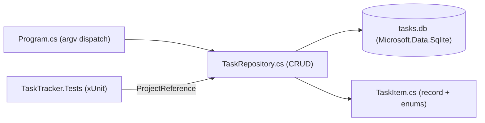

# 22 — Mini Projects

[Back to course overview](../README.md) | [Previous: Solutions](../21-Solutions/README.md)

## Project: Command-Line Task Tracker

A complete, working CLI application that ties together most of the course: records, enums, custom exceptions, LINQ, SQLite persistence via `Microsoft.Data.Sqlite` (Lesson 16's pattern), a multi-project solution (Lesson 15's namespaces/packages pattern), and an xUnit test project referencing the main project (Lesson 18's pattern, extended with a real `ProjectReference` instead of a single-file example).

### What It Does

A command-line tool that tracks tasks in a local SQLite database. You can add a task (with a priority), list all tasks or filter by status, mark a task done, delete a task by id, and see a pending/done summary — all persisted in a `tasks.db` file so data survives between runs.

### Why This Project

It's small enough to read end-to-end in one sitting, but touches nearly every lesson in this course:

| Concept | Where it shows up |
|---|---|
| Records (11) | `TaskItem` and `TaskStats` are immutable records with value equality |
| Enums, pattern-adjacent design (05) | `Priority`/`Status` as enums instead of free-text strings |
| Error handling (09) | Custom `TaskNotFoundException`; validation on empty titles |
| Collections & LINQ (07, 12) | `.Single(...)` lookups in tests, `GROUP BY`-driven `GetStats()` |
| Database access (16) | Full CRUD against `Microsoft.Data.Sqlite`, parameterized queries throughout |
| Modules and packages (15) | Split into `TaskItem.cs`, `TaskRepository.cs`, `TaskNotFoundException.cs`, `Program.cs`, and a separate `TaskTracker.Tests` project referencing `TaskTracker` via `ProjectReference` |
| Nullable reference types (03) | `<Nullable>enable</Nullable>` in both `.csproj` files |
| Testing (18) | `TaskRepositoryTests.cs` — 10 xUnit `[Fact]`s against a fresh in-memory SQLite connection per test |
| Best practices (19) | Custom exceptions instead of generic ones, parameterized SQL, thin CLI layer delegating to a testable repository |

### Project Structure

```
22-Mini-Projects/
├── README.md                          (this file)
├── TaskTracker/
│   ├── TaskTracker.csproj             # Exe project, references Microsoft.Data.Sqlite
│   ├── Program.cs                     # CLI entry point (top-level statements, argv parsing)
│   ├── TaskItem.cs                    # TaskItem record, Priority/Status enums
│   ├── TaskRepository.cs              # SQLite CRUD layer + TaskStats record
│   └── TaskNotFoundException.cs       # custom exception
└── TaskTracker.Tests/
    ├── TaskTracker.Tests.csproj       # xUnit project, ProjectReference -> TaskTracker
    └── TaskRepositoryTests.cs         # 10 [Fact] tests against an in-memory DB
```

### Architecture



### How to Run It

From `22-Mini-Projects/TaskTracker/`:

```bash
dotnet run -- add "Write project README" --priority high
dotnet run -- list
dotnet run -- list --status pending
dotnet run -- done 1
dotnet run -- stats
dotnet run -- delete 3
```

The `--` after `dotnet run` is required so `dotnet` forwards everything after it to the app's own `args`, instead of trying to interpret `add`/`list`/etc. as `dotnet` CLI options itself. The database file `tasks.db` is created automatically in the current directory on first use (via `CREATE TABLE IF NOT EXISTS`).

### Running the Tests

```bash
cd TaskTracker.Tests
dotnet test
```

The test suite uses a **fresh in-memory** SQLite connection (`Data Source=:memory:`) per test — never the real `tasks.db` file — so running tests never touches or resets your actual data. Each test opens its own connection because SQLite's in-memory database only exists for the lifetime of the single connection that created it; sharing one connection across tests would leak state between them.

### Verified Output

This project was actually built, run end-to-end, and tested during course construction. Real, observed output (not fabricated) — `dotnet --version` on the build machine reported `10.0.302`:

```
$ dotnet run -- add "Write project README" --priority high
Added task #1: Write project README (priority=High)

$ dotnet run -- add "Review pull requests" --priority medium
Added task #2: Review pull requests (priority=Medium)

$ dotnet run -- add "Water the plants" --priority low
Added task #3: Water the plants (priority=Low)

$ dotnet run -- list
[ ] #1   Write project README           priority=High   created=2026-07-17
[ ] #2   Review pull requests           priority=Medium created=2026-07-17
[ ] #3   Water the plants               priority=Low    created=2026-07-17

$ dotnet run -- done 1
Marked task #1 as done.

$ dotnet run -- list --status pending
[ ] #2   Review pull requests           priority=Medium created=2026-07-17
[ ] #3   Water the plants               priority=Low    created=2026-07-17

$ dotnet run -- list --status done
[x] #1   Write project README           priority=High   created=2026-07-17

$ dotnet run -- stats
Pending: 2  Done: 1  Total: 3

$ dotnet run -- delete 3
Deleted task #3.

$ dotnet run -- list
[x] #1   Write project README           priority=High   created=2026-07-17
[ ] #2   Review pull requests           priority=Medium created=2026-07-17

$ dotnet run -- done 999
Error: No task found with id 999.

$ dotnet run
Usage:
  dotnet run -- add <title> [--priority low|medium|high]
  dotnet run -- list [--status pending|done]
  dotnet run -- done <id>
  dotnet run -- delete <id>
  dotnet run -- stats
```

And the test run:

```
$ dotnet test
Test run for C:\...\TaskTracker.Tests\bin\Debug\net10.0\TaskTracker.Tests.dll (.NETCoreApp,Version=v10.0)
A total of 1 test files matched the specified pattern.

Passed!  - Failed:     0, Passed:    10, Skipped:     0, Total:    10, Duration: 1 s - TaskTracker.Tests.dll (net10.0)
```

(Exact timing and paths will vary by machine; pass/fail results should not.)

### Bugs and Gotchas Found While Building This

- **`Microsoft.Data.Sqlite` transitively pulls a `SQLitePCLRaw.lib.e_sqlite3` version with a published advisory** (`NU1903`, high severity) on both restore and build. This is a known, longstanding transitive-dependency warning for this package chain, not a bug introduced here — it's called out honestly rather than hidden, and doesn't affect correctness for a local learning project, but a real production app pinning this dependency should track the advisory and upgrade when a fixed version is available.
- **The last-insert-id pattern**: `INSERT ...; SELECT last_insert_rowid();` as a single batched `CommandText`, read via `ExecuteScalar()`, avoids a second round trip just to learn the new row's id. This mirrors Lesson 16's single-purpose command pattern but batches two statements — worth calling out since it's easy to instead write two separate `ExecuteNonQuery`/`ExecuteScalar` calls without realizing SQLite's `last_insert_rowid()` is connection-scoped and safe to call immediately after, within the same connection.
- **`rowsAffected == 0` as the existence check** for `MarkDone`/`DeleteTask` avoids a separate `SELECT`-then-`UPDATE`/`DELETE` (which could race under concurrent access) — this repository is single-user/single-process, so the race isn't a real risk here, but the pattern is worth using by default regardless.

### Possible Extensions (Not Built Here — Left as Further Practice)

- A `--due` date field with sorting/filtering by due date.
- Exporting the task list to CSV or JSON (combining with Lesson 10/Exercise 07's patterns).
- A `--priority` filter on `list`, alongside the existing `--status` filter.
- Swapping the hand-rolled argv parser for `System.CommandLine`.

## Suggested Next Step

You've completed the C# course. Revisit [CHEAT-SHEET.md](../CHEAT-SHEET.md) as a reference, or move on to another language course under [01-Languages](../../README.md).
