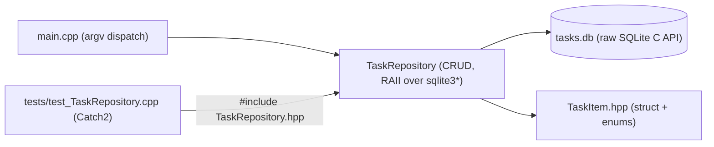

# 22 — Mini Projects

[Back to course overview](../README.md) | [Previous: Solutions](../21-Solutions/README.md)

## Project: Command-Line Task Tracker

A complete, working CLI application that ties together most of the course: RAII wrapping the raw SQLite C API (Lesson 16's pattern, extended per its own README's suggestion to wrap the C handles in an RAII class), a custom exception (`TaskNotFoundException`), enums instead of free-text priority/status strings, a header/source split across multiple files (Lesson 15's pattern), and a Catch2 test suite (Lesson 18's pattern) run against a fresh in-memory SQLite database per test.

### What It Does

A command-line tool that tracks tasks in a local SQLite database. You can add a task (with a priority), list all tasks or filter by status, mark a task done, delete a task by id, and see a pending/done summary — all persisted in a `tasks.db` file so data survives between runs.

### Why This Project

C++ has zero built-in database access (Lesson 16) and zero built-in CLI-argument-parsing library, so this project has to build both the persistence layer and the argv-parsing layer itself, with nothing standard to lean on for either — a genuinely different starting point from the other language courses' Task Trackers, most of which at least get a database driver or an argument-parsing convention for free.

| Concept | Where it shows up |
|---|---|
| RAII / smart-pointer discipline (09, 19) | `TaskRepository` is itself an RAII class wrapping a raw `sqlite3*` handle — Rule of Five implemented by hand (Lesson 19), since the raw C API gives nothing RAII-shaped to compose from instead |
| Custom exceptions (09) | `TaskNotFoundException`; `addTask`/`parsePriority`/`parseStatus` throw `std::invalid_argument` on bad input |
| Enums over free-text strings (05) | `Priority`/`Status` enums, with explicit `toString`/`parse*` conversions at the CLI boundary |
| Database access (16) | Full CRUD against the raw SQLite C API via prepared statements, parameterized throughout — the exact pattern Lesson 16 demonstrates, now wrapped in a reusable class instead of inlined in `main` |
| Modules and packages (15) | Split into `TaskItem.hpp`, `TaskNotFoundException.hpp`, `TaskRepository.hpp`/`.cpp`, `main.cpp`, and a separate `tests/` translation unit — a real header/source split, not a single-file example |
| STL containers (07) | `std::vector<TaskItem>` for `listTasks`, `std::optional<Status>` for the CLI's optional `--status` filter |
| Testing (18) | `tests/test_TaskRepository.cpp` — 11 Catch2 `TEST_CASE`s (24 assertions) against a fresh `:memory:` `TaskRepository` per test |
| Best practices (19) | A custom exception instead of a generic one, parameterized SQL throughout, a thin CLI layer delegating to a testable repository class |

### Project Structure

```
22-Mini-Projects/
├── README.md                           (this file)
└── TaskTracker/
    ├── main.cpp                        # CLI entry point (argv dispatch)
    ├── TaskItem.hpp                    # TaskItem struct, Priority/Status enums + parse/toString
    ├── TaskRepository.hpp / .cpp       # RAII wrapper over sqlite3* -- full CRUD
    ├── TaskNotFoundException.hpp       # custom exception
    └── tests/
        └── test_TaskRepository.cpp     # 11 Catch2 TEST_CASEs against an in-memory DB
```

(`sqlite3.h`/`sqlite3.c` and `catch_amalgamated.hpp`/`.cpp` are deliberately **not** committed — like Lessons 16 and 18, they're downloaded on demand and covered by `.gitignore`, along with `tasks.db` and any build artifact.)

### Architecture



### How to Build and Run It

From `22-Mini-Projects/TaskTracker/`, using a Developer Command Prompt (or after `vcvars64.bat`):

```bash
curl -L -o sqlite-amalgamation.zip "https://www.sqlite.org/2024/sqlite-amalgamation-3450300.zip"
unzip sqlite-amalgamation.zip
cp sqlite-amalgamation-3450300/sqlite3.h sqlite-amalgamation-3450300/sqlite3.c .
rm -rf sqlite-amalgamation.zip sqlite-amalgamation-3450300

cl /EHsc /std:c++20 /Zc:__cplusplus main.cpp TaskRepository.cpp sqlite3.c /Fe:app.exe
# or with g++/clang++:
g++ -std=c++20 main.cpp TaskRepository.cpp sqlite3.c -o app

app.exe add "Write project README" --priority high
app.exe list
app.exe list --status pending
app.exe done 1
app.exe stats
app.exe delete 3
```

`tasks.db` is created automatically in the current directory on first use (via `CREATE TABLE IF NOT EXISTS`).

### Running the Tests

From `22-Mini-Projects/TaskTracker/tests/` (with `sqlite3.c`/`sqlite3.h` already downloaded into the parent `TaskTracker/` directory, as above):

```bash
curl -L -o catch_amalgamated.hpp "https://raw.githubusercontent.com/catchorg/Catch2/v3.7.1/extras/catch_amalgamated.hpp"
curl -L -o catch_amalgamated.cpp "https://raw.githubusercontent.com/catchorg/Catch2/v3.7.1/extras/catch_amalgamated.cpp"

cl /EHsc /std:c++20 /Zc:__cplusplus /I.. test_TaskRepository.cpp ..\TaskRepository.cpp ..\sqlite3.c catch_amalgamated.cpp /Fe:tests.exe
tests.exe
```

The test suite uses a **fresh in-memory** SQLite database (`":memory:"`) opened by a brand-new `TaskRepository` in every single `TEST_CASE` — never the real `tasks.db` file — so running tests never touches or resets your actual data. Each test opens its own connection because SQLite's in-memory database only exists for the lifetime of the single connection that created it; sharing one `TaskRepository` across tests would leak state between them, exactly like the C#/Java/JS mini-projects' own equivalent notes on this.

### Verified Output

This project was actually built, run end-to-end, and tested during course construction with real MSVC 19.51 (`cl /EHsc /std:c++20 /Zc:__cplusplus`). Real, observed output (not fabricated):

```
$ app.exe add "Write project README" --priority high
Added task #1: Write project README (priority=High)

$ app.exe add "Review pull requests" --priority medium
Added task #2: Review pull requests (priority=Medium)

$ app.exe add "Water the plants" --priority low
Added task #3: Water the plants (priority=Low)

$ app.exe list
[ ] #1  Write project README        priority=High   created=2026-07-18 09:59:53
[ ] #2  Review pull requests        priority=Medium created=2026-07-18 09:59:54
[ ] #3  Water the plants            priority=Low    created=2026-07-18 09:59:54

$ app.exe done 1
Marked task #1 as done.

$ app.exe list --status pending
[ ] #2  Review pull requests        priority=Medium created=2026-07-18 09:59:54
[ ] #3  Water the plants            priority=Low    created=2026-07-18 09:59:54

$ app.exe list --status done
[x] #1  Write project README        priority=High   created=2026-07-18 09:59:53

$ app.exe stats
Pending: 2  Done: 1  Total: 3

$ app.exe delete 3
Deleted task #3.

$ app.exe list
[x] #1  Write project README        priority=High   created=2026-07-18 09:59:53
[ ] #2  Review pull requests        priority=Medium created=2026-07-18 09:59:54

$ app.exe done 999
Error: No task found with id 999

$ app.exe delete 999
Error: No task found with id 999

$ app.exe
Usage:
  app add <title> [--priority low|medium|high]
  app list [--status pending|done]
  app done <id>
  app delete <id>
  app stats

$ app.exe add ""
Error: Task title cannot be empty
```

And the test run:

```
$ tests.exe
Randomness seeded to: 887320114
===============================================================================
All tests passed (24 assertions in 11 test cases)
```

(The `created=` timestamps and the random seed will vary run-to-run; the pass/fail results and everything else above should not.)

### Bugs and Gotchas Found While Building This

- **`sqlite3_changes(db)` as the existence check** for `markDone`/`deleteTask` avoids a separate `SELECT`-then-`UPDATE`/`DELETE` round trip (which could race under concurrent access) — this is a single-user CLI, so the race isn't a real risk here, but it's the same pattern the C# mini-project's `TaskRepository` uses (`rowsAffected == 0`) for the identical reason, worth using by default regardless of language.
- **`INSERT ...; SELECT last_insert_rowid();` batching** was deliberately avoided in favor of `sqlite3_last_insert_rowid(db)` called directly after `sqlite3_step` on the insert statement — simpler than the C# version's batched-SQL approach and equally safe, since `last_insert_rowid()` is connection-scoped and doesn't need a second prepared statement at all in the raw C API (unlike `Microsoft.Data.Sqlite`, which has no equivalent single-call accessor and does need the batched-SQL trick).
- **No genuine compile-time or runtime bug was hit building this project's main app or CLI walkthrough** — both `app.exe` and `tests.exe` compiled cleanly on the first attempt with zero warnings under MSVC 19.51, and the full CLI walkthrough plus all 24 test assertions passed on the first real run. Documented honestly here rather than manufacturing a bug for narrative effect, per this repository's own stated preference for honest reporting over a suspiciously smooth story in either direction.
- **`sqlite3_open(":memory:", &db)` behavior confirmed live**: each `TaskRepository(":memory:")` genuinely gets its own private, empty in-memory database — every `TEST_CASE` that calls `addTask` first asserts its returned id is `1` (e.g. `"addTask returns an incrementing id"`, `"listTasks filters by status"`), and all of them pass in the same run; if state leaked between `TEST_CASE`s sharing one underlying connection, only the first such test could ever see id `1`, so the full 24/24 pass is itself the proof, re-confirmed by running the whole suite twice in a row with identical results both times.

### Possible Extensions (Not Built Here — Left as Further Practice)

- A `--due` date field with sorting/filtering by due date.
- A `--priority` filter on `list`, alongside the existing `--status` filter.
- Wrapping `sqlite3_stmt*` itself in a small RAII class (a `PreparedStatement` guard calling `sqlite3_finalize` in its destructor) instead of manually finalizing at the end of every `TaskRepository` method — the natural next refactor once a project has more than a handful of queries.
- A CMake build (Lesson 15) instead of the direct `cl`/`g++` invocations shown above, for a project this size that would realistically want one.

## Suggested Next Step

You've completed the C++ course, including lessons 20–22. Revisit [CHEAT-SHEET.md](../CHEAT-SHEET.md) as a reference, or move on to another language course under [01-Languages](../../README.md).
