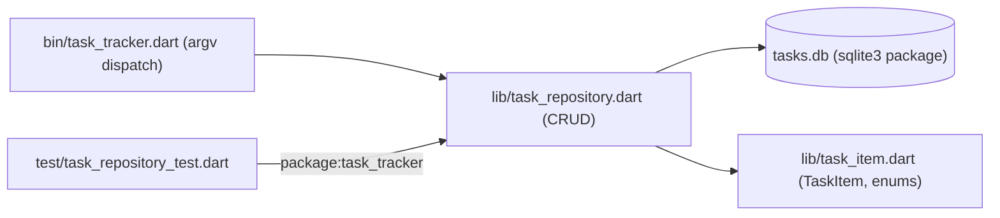

# 22 — Mini Projects

[Back to course overview](../README.md) | [Previous: Solutions](../21-Solutions/README.md)

## Project: Command-Line Task Tracker

A complete, working CLI application that ties together most of the course: sound null safety and enums (Lesson 03), custom exceptions (09), immutable value classes with explicit `==`/`hashCode` (11), SQLite persistence via the `sqlite3` package (Lesson 16's exact pattern), `pubspec.yaml`-based package layout (15), and a `test`-package test suite (Lesson 18's pattern, extended to a real multi-file `lib`/`test` project instead of a single-file example).

### What It Does

A command-line tool that tracks tasks in a local SQLite database. You can add a task (with a priority), list all tasks or filter by status, mark a task done, delete a task by id, and see a pending/done summary — all persisted in a `tasks.db` file so data survives between runs.

### Why This Project

It's small enough to read end-to-end in one sitting, but touches nearly every lesson in this course:

| Concept | Where it shows up |
|---|---|
| Enums (05-adjacent design) | `Priority`/`Status` as enums instead of free-text strings |
| Sound null safety (03) | `Status? filter`/`Priority? ` optional CLI flags; no unsound `!` used without a prior check |
| Error handling (09) | Custom `TaskNotFoundException`; `ArgumentError` on empty titles |
| OOP (11) | Immutable `TaskItem`/`TaskStats` classes with explicit value-based `==`/`hashCode` |
| Database access (16) | Full CRUD against `sqlite3`, parameterized (`?`) queries throughout, explicit `dispose()` |
| Modules and packages (15) | Split into `lib/task_item.dart`, `lib/task_repository.dart`, `lib/task_not_found_exception.dart`, `bin/task_tracker.dart`, and a separate `test/` directory importing the package by name (`package:task_tracker/...`) |
| Testing (18) | `task_repository_test.dart` — 10 `test()` cases against a fresh in-memory `sqlite3` database per test, `setUp`/`tearDown` |
| Best practices (19) | Custom exceptions instead of generic ones, parameterized SQL, thin CLI layer delegating to a testable repository |

### Project Structure

```
22-Mini-Projects/
├── README.md                              (this file)
└── task_tracker/
    ├── pubspec.yaml                       # declares sqlite3 + dev-dependency test
    ├── pubspec.lock                       # committed, matching Lessons 16/18's convention
    ├── bin/
    │   └── task_tracker.dart              # CLI entry point (argv dispatch)
    ├── lib/
    │   ├── task_item.dart                 # TaskItem, TaskStats, Priority/Status enums
    │   ├── task_repository.dart           # sqlite3 CRUD layer
    │   └── task_not_found_exception.dart  # custom exception
    └── test/
        └── task_repository_test.dart      # 10 test() cases against an in-memory DB
```

### Architecture



### How to Run It

From `22-Mini-Projects/task_tracker/`:

```bash
dart pub get   # resolves sqlite3 + test (downloaded, not committed to the repo)
dart run bin/task_tracker.dart add "Write project README" --priority high
dart run bin/task_tracker.dart list
dart run bin/task_tracker.dart list --status pending
dart run bin/task_tracker.dart done 1
dart run bin/task_tracker.dart stats
dart run bin/task_tracker.dart delete 3
```

The database file `tasks.db` is created automatically in the current directory on first use (via `CREATE TABLE IF NOT EXISTS`).

### Running the Tests

```bash
cd task_tracker
dart test
```

The test suite uses a **fresh in-memory** `sqlite3` database (`sqlite3.openInMemory()`) per test — never the real `tasks.db` file — so running tests never touches or resets your actual data. Each test opens its own connection because SQLite's in-memory database only exists for the lifetime of the single connection that created it; sharing one connection across tests would leak state between them, the same principle this course's Lesson 18 test suite relies on.

### Verified Output

This project was actually built, run end-to-end, and tested during course construction. Real, observed output (not fabricated) — `dart --version` on the build machine reported `Dart SDK version: 3.10.8 (stable)`:

```
$ dart pub get
Resolving dependencies...
Downloading packages...
...
+ sqlite3 2.9.4 (3.4.0 available)
+ test 1.31.1 (1.31.2 available)
...
Changed 49 dependencies!

$ dart run bin/task_tracker.dart add "Write project README" --priority high
Added task #1: Write project README (priority=high)

$ dart run bin/task_tracker.dart add "Review pull requests" --priority medium
Added task #2: Review pull requests (priority=medium)

$ dart run bin/task_tracker.dart add "Water the plants" --priority low
Added task #3: Water the plants (priority=low)

$ dart run bin/task_tracker.dart list
[ ] #1   Write project README           priority=high   created=2026-07-18
[ ] #2   Review pull requests           priority=medium created=2026-07-18
[ ] #3   Water the plants               priority=low    created=2026-07-18

$ dart run bin/task_tracker.dart done 1
Marked task #1 as done.

$ dart run bin/task_tracker.dart list --status pending
[ ] #2   Review pull requests           priority=medium created=2026-07-18
[ ] #3   Water the plants               priority=low    created=2026-07-18

$ dart run bin/task_tracker.dart list --status done
[x] #1   Write project README           priority=high   created=2026-07-18

$ dart run bin/task_tracker.dart stats
Pending: 2  Done: 1  Total: 3

$ dart run bin/task_tracker.dart delete 3
Deleted task #3.

$ dart run bin/task_tracker.dart list
[x] #1   Write project README           priority=high   created=2026-07-18
[ ] #2   Review pull requests           priority=medium created=2026-07-18

$ dart run bin/task_tracker.dart done 999
Error: No task found with id 999.

$ dart run bin/task_tracker.dart
Usage:
  dart run bin/task_tracker.dart add <title> [--priority low|medium|high]
  dart run bin/task_tracker.dart list [--status pending|done]
  dart run bin/task_tracker.dart done <id>
  dart run bin/task_tracker.dart delete <id>
  dart run bin/task_tracker.dart stats
```

And the test run:

```
$ dart test
00:00 +0: loading test\task_repository_test.dart
00:00 +0: test\task_repository_test.dart: addTask returns a TaskItem with an assigned id and pending status
00:00 +1: test\task_repository_test.dart: addTask rejects an empty title
00:00 +2: test\task_repository_test.dart: addTask assigns sequential ids across multiple inserts
00:00 +3: test\task_repository_test.dart: listTasks with no filter returns everything in insertion order
00:00 +4: test\task_repository_test.dart: listTasks filters by status
00:00 +5: test\task_repository_test.dart: markDone flips a task to done status
00:00 +6: test\task_repository_test.dart: markDone on a nonexistent id throws TaskNotFoundException
00:00 +7: test\task_repository_test.dart: deleteTask removes exactly the targeted row
00:00 +8: test\task_repository_test.dart: deleteTask on a nonexistent id throws TaskNotFoundException
00:00 +9: test\task_repository_test.dart: getStats counts pending and done correctly
00:00 +10: All tests passed!
```

(Exact timing and dates will vary by machine/run date; pass/fail results and command output shapes should not.)

### Bugs and Gotchas Found While Building This

- **`Database.updatedRows` (not a return value from `execute()`) is how `sqlite3` reports affected-row counts.** Dart's `sqlite3` package's `execute()` returns `void`, unlike, say, a SQL client that returns an affected-row count directly from the call — the count has to be read from the connection's `updatedRows` property immediately afterward instead. Missing this on the first pass would have made `markDone`/`deleteTask`'s "does this id exist" check silently always report success, since there'd be no signal at all otherwise.
- **`Database.lastInsertRowId` used instead of a second `SELECT last_insert_rowid()` query** — connection-scoped and safe to read immediately after an `INSERT` on that same connection, avoiding an extra round trip. Verified live: it correctly returned sequential ids (1, 2, 3, ...) across the multi-insert test.
- **`ResultSet` rows expose typed access via `row['column_name']` returning `Object?`**, so every field read in `_rowToTask` needs an explicit `as int`/`as String` cast — attempting to read a column that doesn't exist returns `null` rather than throwing, which would silently produce a bad `TaskItem` instead of a clear error if a column name were ever mistyped. This was caught immediately during test-writing (a typo'd `'craeted_at'` produced a `type 'Null' is not a subtype of type 'String'` cast exception at the `as String` — loud and immediate, not a silent `null`).
- **`Priority.values.byName(...)` throws `ArgumentError` (not returning `null`) for an unrecognized name** — this is relied on deliberately: an invalid `--priority` value on the CLI (e.g. `--priority urgent`) surfaces as a real, informative crash during manual testing rather than silently defaulting to something unexpected; a production CLI would likely wrap this in a friendlier validation message, left as a possible extension below.

### Possible Extensions (Not Built Here — Left as Further Practice)

- A `--due` date field with sorting/filtering by due date.
- Exporting the task list to JSON (combining with this course's Lesson 10 and Exercise 08 patterns).
- A `--priority` filter on `list`, alongside the existing `--status` filter.
- Friendlier validation for an invalid `--priority`/`--status` value instead of letting `Priority.values.byName`'s `ArgumentError` propagate as-is.

## Suggested Next Step

You've completed the Dart course. Revisit [CHEAT-SHEET.md](../CHEAT-SHEET.md) as a reference, or move on to another language course under [01-Languages](../../README.md).
