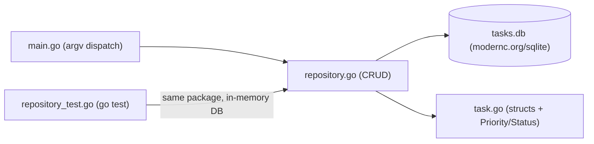

# 22 — Mini Projects

[Back to course overview](../README.md) | [Previous: Solutions](../21-Solutions/README.md)

## Project: Command-Line Task Tracker

A complete, working CLI application tying together most of the course: structs with methods and a custom `error` type (Lesson 11, 09), the `(value, error)` return pattern used consistently instead of exceptions (Lesson 09), `database/sql` against the pure-Go `modernc.org/sqlite` driver (Lesson 16's exact approach, deliberately avoiding a CGO/C-toolchain dependency), and the built-in `testing` package with table-driven tests (Lesson 18's pattern).

### What It Does

A command-line tool that tracks tasks in a local SQLite database. You can add a task (with a priority), list all tasks or filter by status, mark a task done, delete a task by id, and see a pending/done summary — all persisted in a `tasks.db` file so data survives between runs.

### Why This Project

It's small enough to read end-to-end in one sitting, but touches nearly every lesson in this course:

| Concept | Where it shows up |
|---|---|
| Structs and methods, no classes (11) | `TaskItem`/`TaskStats` plain structs; `Priority`/`Status` typed-int "enums" with a `String()` method |
| The `(value, error)` pattern (09) | Every `Repository` method returns `(T, error)`; `main.go` checks `if err != nil` at every call site, never a `try`/`catch` |
| Custom error types (09) | `*TaskNotFoundError` — a struct implementing `error`, recovered via `errors.As` in the tests |
| Database access (16) | Full CRUD against `database/sql` + `modernc.org/sqlite`, parameterized `?` queries throughout, `last_insert_rowid()` for the add-then-read-id pattern |
| Modules and packages (15) | A single Go module (`go.mod`/`go.sum`, genuinely committed — small legitimate text files, not the dependency code itself) split across `main.go`, `task.go`, `repository.go`, `errors.go`, with `repository_test.go` alongside them |
| Testing (18) | `repository_test.go` — 12 tests (9 standalone `Test*` functions plus a 3-case table-driven `TestStats`) run against a fresh in-memory `:memory:` connection per test |
| Best practices (19) | A thin CLI layer (`main.go`) delegating to a testable `Repository`, parameterized SQL everywhere, custom errors instead of bare strings, `RowsAffected == 0` as the existence check instead of a racy SELECT-then-UPDATE pair |

### Project Structure

```
22-Mini-Projects/
├── README.md                  (this file)
└── TaskTracker/
    ├── go.mod                 # module tasktracker, requires modernc.org/sqlite
    ├── go.sum                 # committed -- small text file, not the dependency code itself
    ├── main.go                # CLI entry point: argv parsing + dispatch only
    ├── task.go                # TaskItem/TaskStats structs, Priority/Status "enums"
    ├── repository.go          # all database/sql access -- CRUD + Stats
    ├── errors.go               # TaskNotFoundError
    └── repository_test.go     # 12 tests, table-driven Stats case, fresh in-memory DB per test
```

### Architecture



### How to Run It

From `22-Mini-Projects/TaskTracker/`:

```bash
go run . add "Write project README" --priority high
go run . list
go run . list --status pending
go run . done 1
go run . stats
go run . delete 3
```

`go run .` compiles and runs every `.go` file in the current directory as one package (unlike `go run main.go`, which would only compile that single file and miss `task.go`/`repository.go`/`errors.go`). The database file `tasks.db` is created automatically in the current directory on first use (via `CREATE TABLE IF NOT EXISTS`), and is covered by this repository's root `.gitignore` (`*.db`) — it's a runtime artifact, not source.

### Running the Tests

```bash
cd TaskTracker
go test -v ./...
```

Every test opens its **own fresh in-memory** SQLite connection (`sql.Open("sqlite", ":memory:")`) via a shared `newTestRepo(t)` helper — never the real `tasks.db` file — so running tests never touches or resets your actual data. Each test gets its own connection because SQLite's in-memory database only exists for the lifetime of the single connection that created it; sharing one connection across tests (or using `TestMain` for shared setup) would leak state between them, which is exactly the isolation table-driven subtests (`t.Run`) are meant to preserve.

### Verified Output

This project was actually built, run end-to-end, and tested during course construction. Real, observed output (not fabricated) — `go version` on the build machine reported `go1.23.4 windows/amd64` (SDK downloaded fresh into a scratch location for this session, matching how Lessons 01–19 obtained it):

```
$ go run . add "Write project README" --priority high
Added task #1: Write project README (priority=High)

$ go run . add "Review pull requests" --priority medium
Added task #2: Review pull requests (priority=Medium)

$ go run . add "Water the plants" --priority low
Added task #3: Water the plants (priority=Low)

$ go run . list
[ ] #1   Write project README           priority=High   created=2026-07-18
[ ] #2   Review pull requests           priority=Medium created=2026-07-18
[ ] #3   Water the plants               priority=Low    created=2026-07-18

$ go run . done 1
Marked task #1 as done.

$ go run . list --status pending
[ ] #2   Review pull requests           priority=Medium created=2026-07-18
[ ] #3   Water the plants               priority=Low    created=2026-07-18

$ go run . list --status done
[x] #1   Write project README           priority=High   created=2026-07-18

$ go run . stats
Pending: 2  Done: 1  Total: 3

$ go run . delete 3
Deleted task #3.

$ go run . list
[x] #1   Write project README           priority=High   created=2026-07-18
[ ] #2   Review pull requests           priority=Medium created=2026-07-18

$ go run . done 999
Error: no task found with id 999
exit status 1

$ go run .
Usage:
  tasktracker add <title> [--priority low|medium|high]
  tasktracker list [--status pending|done]
  tasktracker done <id>
  tasktracker delete <id>
  tasktracker stats
```

And the test run:

```
$ go test -v ./...
=== RUN   TestAddInsertsTaskWithPendingStatus
--- PASS: TestAddInsertsTaskWithPendingStatus (0.01s)
=== RUN   TestAddAssignsIncrementingIDs
--- PASS: TestAddAssignsIncrementingIDs (0.00s)
=== RUN   TestListReturnsAllTasksWhenNoFilterGiven
--- PASS: TestListReturnsAllTasksWhenNoFilterGiven (0.00s)
=== RUN   TestListFiltersByStatus
--- PASS: TestListFiltersByStatus (0.00s)
=== RUN   TestMarkDoneUpdatesStatus
--- PASS: TestMarkDoneUpdatesStatus (0.00s)
=== RUN   TestMarkDoneReturnsTaskNotFoundErrorForMissingID
--- PASS: TestMarkDoneReturnsTaskNotFoundErrorForMissingID (0.00s)
=== RUN   TestDeleteRemovesTask
--- PASS: TestDeleteRemovesTask (0.00s)
=== RUN   TestDeleteReturnsTaskNotFoundErrorForMissingID
--- PASS: TestDeleteReturnsTaskNotFoundErrorForMissingID (0.00s)
=== RUN   TestStats
=== RUN   TestStats/empty_repository
=== RUN   TestStats/all_pending
=== RUN   TestStats/mixed_pending_and_done
--- PASS: TestStats (0.00s)
    --- PASS: TestStats/empty_repository (0.00s)
    --- PASS: TestStats/all_pending (0.00s)
    --- PASS: TestStats/mixed_pending_and_done (0.00s)
PASS
ok  	tasktracker	2.512s
```

(Exact timing will vary by machine; pass/fail results and the printed output should not. `done 999` exits with status 1, printed by Go's own `os.Exit(1)` path in `main.go` — `exit status 1` in the transcript above is the shell reporting that exit code, not a line the program itself printed.)

### Bugs and Gotchas Found While Building This

- **`go run main.go` only compiles that one file** — it does **not** pick up the sibling `task.go`/`repository.go`/`errors.go` files in the same package, unlike `go build`/`go test`, which always operate on the whole package in a directory. This mini project genuinely needs `go run .` (or `go run *.go`), not `go run main.go`, and that distinction is easy to miss coming from Lessons 01–14's single-file examples where `go run main.go` was always correct because there was only ever one file. Verified live: `go run main.go` alone fails to build with an `undefined: NewRepository` error.
- **`go mod tidy` silently drops a not-yet-imported dependency.** `go get modernc.org/sqlite@v1.53.0` was run before `main.go` existed (to warm the module cache); the very next `go mod tidy`, seeing no file actually importing `modernc.org/sqlite` yet, removed the requirement from `go.mod` entirely. It only came back — pinned to whatever the latest resolvable version was (`v1.54.0`, one patch ahead of Lesson 16's `v1.53.0`) — once `main.go`'s blank `_ "modernc.org/sqlite"` import existed for `tidy` to find. Lesson: write the importing code before trusting `go mod tidy` to keep a dependency around.
- **`go build` (used once, mid-development, to sanity-check compilation) leaves a `tasktracker.exe` in the directory** — unlike `go run`, which builds to a temp location and cleans up after itself. Caught and deleted before committing; `go run`/`go test` were used for every other verification step specifically to avoid this.
- **The last-insert-id pattern**: `INSERT ...` followed immediately by `result.LastInsertId()` (backed by SQLite's `last_insert_rowid()`) avoids a second round trip just to learn the new row's id. This mirrors Lesson 16's single-purpose command style, and is safe here because it's read from the same `*sql.DB` connection that just did the insert — `last_insert_rowid()` is connection-scoped.
- **`RowsAffected == 0` as the existence check** for `MarkDone`/`Delete` avoids a separate `SELECT`-then-`UPDATE`/`DELETE` (which could race under concurrent access). This mini project is single-user/single-process, so the race isn't a real risk here, but the pattern — check the mutation's own result rather than querying first — is worth using by default regardless.

### Possible Extensions (Not Built Here — Left as Further Practice)

- A `--due` date field with sorting/filtering by due date.
- Exporting the task list to JSON (combining with Exercise 07's `encoding/json` roundtrip pattern from [20-Exercises](../20-Exercises/README.md)).
- A `--priority` filter on `list`, alongside the existing `--status` filter.
- Swapping the hand-rolled `findFlagValue` argv scan for the standard `flag` package, or a third-party CLI framework like `cobra`.
- Concurrent task processing using Exercise 06's goroutine/channel pattern (e.g. batch-importing tasks from multiple files at once).

## Suggested Next Step

You've completed the Go course. Revisit [CHEAT-SHEET.md](../CHEAT-SHEET.md) as a reference, or move on to another language course under [01-Languages](../../README.md).
