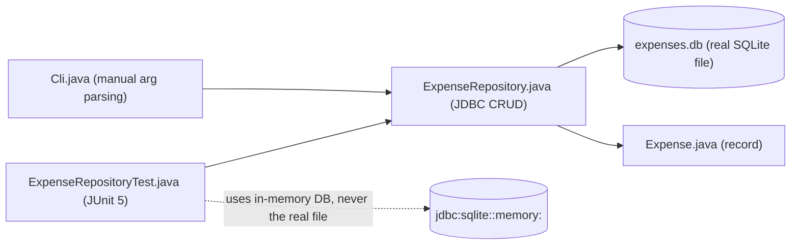

# 22 — Mini Projects

[Back to course overview](../README.md) | [Previous: Solutions](../21-Solutions/README.md)

## Project: Command-Line Expense Tracker

A complete, working CLI application that ties together most of the course: JDBC/SQLite database access, custom checked exceptions, records, Maven dependency management, and a JUnit 5 test suite — the same project concept as the reference [Python course's mini-project](../../Python/22-Mini-Projects/README.md), rebuilt idiomatically in Java rather than translated line-by-line.

### What It Does

A command-line tool that tracks expenses in a local SQLite database. You can add an expense (amount, category, description), list all expenses, filter by category, see a total, and delete an expense by id — all persisted in an `expenses.db` file so data survives between runs.

### Why This Project

It's small enough to read end-to-end in one sitting, but touches nearly every lesson in this course:

| Concept | Where it shows up |
|---|---|
| Records (11-OOP) | `Expense` is a Java `record` — immutable, with a free correct `toString`/`equals`/`hashCode` |
| Error handling (09) | Custom checked `ExpenseNotFoundException`; `IllegalArgumentException` on invalid amounts |
| Database access (16) | Full CRUD against real SQLite via JDBC, every query using a `PreparedStatement` |
| Modules & packages (15) | A real Maven project (`pom.xml`) with a managed `sqlite-jdbc` dependency, instead of the single-file `curl`-a-JAR style used for the standalone lesson |
| Collections (07) | Building/filtering the expense list |
| Testing (18) | `ExpenseRepositoryTest` — 9 JUnit 5 tests against an in-memory SQLite database |
| Best practices (19) | No mutable shared state, `try-with-resources` everywhere a `Connection`/`Statement`/`ResultSet` is opened |

### Project Structure

```
22-Mini-Projects/
├── README.md                  (this file)
└── expense-tracker/
    ├── pom.xml
    └── src/
        ├── main/java/com/example/expensetracker/
        │   ├── Expense.java              # record: id, amount, category, description
        │   ├── ExpenseNotFoundException.java
        │   ├── ExpenseRepository.java     # JDBC CRUD layer
        │   └── Cli.java                    # command-line entry point
        └── test/java/com/example/expensetracker/
            └── ExpenseRepositoryTest.java   # JUnit 5 suite against an in-memory DB
```

### Architecture



### How to Run It

```bash
cd 22-Mini-Projects/expense-tracker
mvn compile

# Add an expense
mvn -q exec:java -Dexec.args="add 42.50 groceries 'Weekly shop'"

# List all expenses
mvn -q exec:java -Dexec.args="list"

# List only one category
mvn -q exec:java -Dexec.args="list --category groceries"

# Show the running total
mvn -q exec:java -Dexec.args="total"

# Delete an expense by its id
mvn -q exec:java -Dexec.args="delete 1"
```

The database file `expenses.db` is created automatically in the current directory on first use.

### Running the Tests

```bash
cd expense-tracker
mvn test
```

The test suite uses an **in-memory** SQLite database (`jdbc:sqlite::memory:`), never the real `expenses.db` file, so running tests never touches or resets your actual data.

### Verified Output

This project was actually built and run end-to-end during course construction. Real, observed output (not fabricated):

```
$ java -cp <classpath> com.example.expensetracker.Cli add 42.50 groceries "Weekly shop"
Added expense #1: $42.50 [groceries] Weekly shop

$ java -cp <classpath> com.example.expensetracker.Cli add 15.00 transport "Bus pass"
Added expense #2: $15.00 [transport] Bus pass

$ java -cp <classpath> com.example.expensetracker.Cli list
#1   $42.50    groceries    Weekly shop
#2   $15.00    transport    Bus pass

$ java -cp <classpath> com.example.expensetracker.Cli list --category groceries
#1   $42.50    groceries    Weekly shop

$ java -cp <classpath> com.example.expensetracker.Cli total
Total spent: $57.50

$ java -cp <classpath> com.example.expensetracker.Cli delete 1
Deleted expense #1

$ java -cp <classpath> com.example.expensetracker.Cli list
#2   $15.00    transport    Bus pass
```

And the test run:

```
$ mvn test
[INFO] Running com.example.expensetracker.ExpenseRepositoryTest
[INFO] Tests run: 9, Failures: 0, Errors: 0, Skipped: 0, Time elapsed: 0.614 s
[INFO] BUILD SUCCESS
```

(Exact timing will vary by machine; pass/fail results should not.)

### Possible Extensions (Not Built Here — Left as Further Practice)

- A `--month` filter using SQLite's date functions.
- Exporting to CSV.
- A budget/limit per category with a warning when exceeded.
- Swapping manual `args[]` parsing for a proper CLI argument-parsing library (e.g., `picocli`).

## Suggested Next Step

You've completed the Java course, including its exercises, solutions, and mini-project. Revisit [CHEAT-SHEET.md](../CHEAT-SHEET.md) as a reference, or move on to another language course under [01-Languages](../../README.md).
