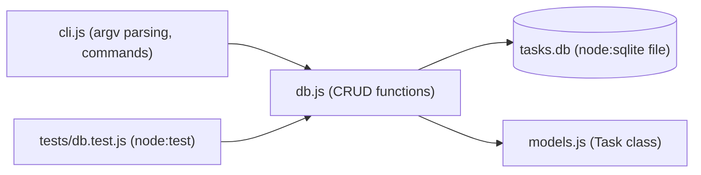

# 22 — Mini Projects

[Back to course overview](../README.md) | [Previous: Solutions](../21-Solutions/README.md)

## Project: Command-Line Task Tracker

A complete, working CLI application that ties together most of the course: functions, error handling, OOP-lite value objects, database access (`node:sqlite`), CommonJS modules, and a `node:test` suite — the same scope and rigor as the Python course's [expense tracker](../../Python/22-Mini-Projects/expense_tracker/) and the Java course's [Maven expense tracker](../../Java/22-Mini-Projects/expense-tracker/), adapted to a task tracker instead of an expense tracker so it isn't just a re-skin.

Consistent with the rest of this JavaScript course (Lesson 16's `node:sqlite`, Lesson 17's built-in `fetch`, Lesson 18's `node:test`), this project uses **zero npm installs** — only Node's built-in `node:sqlite` module and hand-rolled `process.argv` parsing, no `package.json` dependencies at all.

### What It Does

A command-line tool that tracks tasks in a local SQLite database. You can add a task (title, priority), list tasks (optionally filtered by status), mark one done, delete one by id, and see a pending/done summary — all persisted in a `tasks.db` file so data survives between runs.

### Why This Project

It's small enough to read end-to-end in one sitting, but touches nearly every lesson in this course:

| Concept | Where it shows up |
|---|---|
| Functions (06) | Every `db.js` function is a small, single-purpose function |
| Error handling (09) | Custom `TaskNotFoundError`; `RangeError` on invalid input |
| OOP (11) | `Task` class with a `toString()` override |
| Collections (07) | Filtering/summarizing tasks via SQL + array `.map()` |
| Database access (16) | Full CRUD against `node:sqlite`, parameterized queries throughout |
| Modules and packages (15) | Split into `models.js`, `db.js`, `cli.js` via CommonJS `require`/`module.exports` |
| Async and Concurrency (14) | Not needed here — `node:sqlite`'s synchronous API (`DatabaseSync`) is used deliberately, the same choice Lesson 16 makes, since a single-user local CLI has no concurrent-access problem to solve |
| Testing (18) | `tests/db.test.js` using `node:test` + `assert/strict` against an in-memory database |
| Best practices (19) | Validation lives in `db.js` (not just the CLI layer), no swallowed unexpected errors, clear naming |

### Project Structure

```
22-Mini-Projects/
├── README.md                  (this file)
└── task-tracker/
    ├── models.js               # Task class
    ├── db.js                   # node:sqlite CRUD layer
    ├── cli.js                  # command-line entry point (hand-rolled argv parsing)
    └── tests/
        └── db.test.js          # node:test suite against an in-memory DB
```

### Architecture



### How to Run It

From inside `task-tracker/`:

```bash
# Add a task (priority defaults to "medium" if omitted)
node cli.js add "Write lesson" --priority high

# List all tasks
node cli.js list

# List only pending tasks
node cli.js list --status pending

# Mark a task done by its id
node cli.js done 1

# Delete a task by its id
node cli.js delete 2

# Show a pending/done summary
node cli.js summary
```

The database file `tasks.db` is created automatically in the project directory on first use.

### Running the Tests

```bash
cd task-tracker
node --test
```

**A real, reproduced gotcha** worth documenting rather than smoothing over: on this Node version (24.12.0), running `node --test tests/` or `node --test tests` — passing the test directory explicitly as an argument — fails with `Error: Cannot find module '...\tests'` / `MODULE_NOT_FOUND`, because it's interpreted as a request to `require()` that path as a single file rather than as "discover tests under this directory." Bare `node --test` (no path argument) uses `node:test`'s own directory auto-discovery and correctly finds `tests/db.test.js`. Use the bare form.

The test suite uses an **in-memory** `node:sqlite` database (`":memory:"`), never the real `tasks.db` file, so running tests never touches or resets your actual data.

### Verified Output

This project was actually built and run end-to-end during course construction. Real, observed output (not fabricated) — `node:sqlite`'s experimental-feature warning (expected, and already documented in Lesson 16) is trimmed from each line below for readability, but did print on every invocation:

```
$ node cli.js add "Write lesson" --priority high
Added task #1: [high] Write lesson

$ node cli.js add "Test examples"
Added task #2: [medium] Test examples

$ node cli.js add "Ship it" --priority low
Added task #3: [low] Ship it

$ node cli.js list
[ ] #1  (high)  Write lesson
[ ] #2  (medium)  Test examples
[ ] #3  (low)  Ship it

$ node cli.js list --status pending
[ ] #1  (high)  Write lesson
[ ] #2  (medium)  Test examples
[ ] #3  (low)  Ship it

$ node cli.js done 1
Marked task #1 done

$ node cli.js list
[x] #1  (high)  Write lesson
[ ] #2  (medium)  Test examples
[ ] #3  (low)  Ship it

$ node cli.js summary
Total: 3  Pending: 2  Done: 1

$ node cli.js delete 2
Deleted task #2

$ node cli.js list
[x] #1  (high)  Write lesson
[ ] #3  (low)  Ship it

$ node cli.js done 999
Error: No task with id 999
(exit code 1)
```

And the test run:

```
$ node --test
✔ initDb creates an empty tasks table (26.5ms)
✔ addTask returns an incrementing id (2.1ms)
✔ addTask defaults priority to medium and status to pending (3.0ms)
✔ addTask rejects an empty title (2.7ms)
✔ addTask rejects an invalid priority (1.1ms)
✔ listTasks returns all tasks in insertion order (1.1ms)
✔ listTasks filters by status (1.1ms)
✔ markDone flips a task's status (1.1ms)
✔ markDone on a nonexistent id throws TaskNotFoundError (0.9ms)
✔ deleteTask removes the row (5.4ms)
✔ deleteTask on a nonexistent id throws TaskNotFoundError (0.8ms)
✔ summary counts pending and done tasks separately (2.6ms)
✔ summary on an empty table reports all zeros (1.1ms)
ℹ tests 13
ℹ suites 0
ℹ pass 13
ℹ fail 0
ℹ cancelled 0
ℹ skipped 0
ℹ todo 0
```

(Exact timing will vary by machine; pass/fail results should not.)

### Possible Extensions (Not Built Here — Left as Further Practice)

- A `--priority` filter on `list`, matching the existing `--status` filter.
- Due dates using SQL date functions.
- Exporting to CSV or JSON.
- Swapping the hand-rolled `process.argv` parser for Node's built-in `node:util.parseArgs` (stable since Node 20) once the flag set grows past what a few `if`/`switch` branches can handle cleanly.

## Suggested Next Step

You've completed the JavaScript course through Lesson 22. Revisit [CHEAT-SHEET.md](../CHEAT-SHEET.md) as a reference, or move on to [TypeScript](../../TypeScript/README.md), which builds directly on this course.
