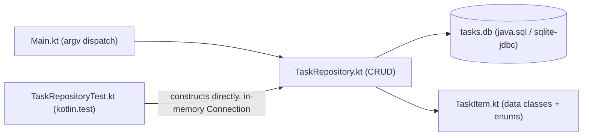

# 22 — Mini Projects

[Back to course overview](../README.md) | [Previous: Solutions](../21-Solutions/README.md)

## Project: Command-Line Task Tracker

A complete, working CLI application that ties together most of the course: data classes, enums, custom exceptions, JDBC/SQLite persistence via `.use { }` (Lesson 16's pattern), and a `kotlin.test`/JUnit 5 suite (Lesson 18's pattern, extended to a real multi-file, in-memory-database test target instead of a single-file example).

### What It Does

A command-line tool that tracks tasks in a local SQLite database. You can add a task (with a priority), list all tasks or filter by status, mark a task done, delete a task by id, and see a pending/done summary — all persisted in a `tasks.db` file so data survives between runs.

### Why This Project

It's small enough to read end-to-end in one sitting, but touches nearly every lesson in this course:

| Concept | Where it shows up |
|---|---|
| Data classes (11) | `TaskItem` and `TaskStats` are immutable data classes with value equality |
| Enums instead of free-text strings (05-adjacent) | `Priority`/`Status` as enums rather than raw strings in the database |
| Error handling (09) | Custom `TaskNotFoundException`; `require()`-based blank-title validation |
| Null safety (03) | `?.let { }`/`?:` throughout the CLI argument parsing in `Main.kt` |
| Database access (16) | Full CRUD against `java.sql`/`sqlite-jdbc`, `.use { }` for every resource, parameterized `?` queries throughout |
| Collections (07) | `listTasks()` returns a genuine `List` (not the same mutable backing reference), avoiding Lesson 07/19's exposed-mutable-collection bug |
| Testing (18) | `TaskRepositoryTest.kt` — 10 `kotlin.test` tests against a fresh in-memory SQLite connection per test |
| Best practices (19) | A specific custom exception instead of a generic one, parameterized SQL, a thin CLI layer delegating to a testable repository |

### Project Structure

```
22-Mini-Projects/
├── README.md                          (this file)
└── TaskTracker/
    ├── src/
    │   ├── TaskItem.kt                # TaskItem/TaskStats data classes, Priority/Status enums
    │   ├── TaskRepository.kt          # JDBC CRUD layer (connection injected, not opened internally)
    │   ├── TaskNotFoundException.kt   # custom exception
    │   └── Main.kt                    # CLI entry point (argv dispatch)
    └── tests/
        └── TaskRepositoryTest.kt      # 10 kotlin.test tests against an in-memory DB
```

There's no separate `TaskTracker.Tests`-style project the way the C#/Java courses' mini-projects have one, because Kotlin's single-file `kotlinc` compilation model (used throughout this course, matching Lessons 01–19) makes a single `tests/` folder compiled alongside `src/` sufficient — the connection-injection design in `TaskRepository` (see below) is what actually gives the tests isolation, not a separate project boundary.

### Architecture



### Dependencies (Downloaded, Not Committed)

Matching this repository's established convention (`.gitignore` excludes `*.jar`), this project needs three JARs not shipped with plain `kotlinc`:

- `sqlite-jdbc.jar` (org.xerial, same as Lesson 16) — [Maven Central](https://repo1.maven.org/maven2/org/xerial/sqlite-jdbc/3.47.1.0/sqlite-jdbc-3.47.1.0.jar)
- `junit-platform-console-standalone.jar` (same as Lesson 18) — [Maven Central](https://repo1.maven.org/maven2/org/junit/platform/junit-platform-console-standalone/1.11.4/junit-platform-console-standalone-1.11.4.jar)
- `kotlin-test.jar` / `kotlin-test-junit5.jar` — already bundled inside `kotlinc`'s own `lib/` directory (no separate download needed, same as Lesson 18)

### How to Build and Run It

From `22-Mini-Projects/TaskTracker/`:

```bash
kotlinc -cp sqlite-jdbc.jar src/*.kt -d out
java -cp "out;sqlite-jdbc.jar;<kotlinc-lib>/kotlin-stdlib.jar" MainKt add "Write project README" --priority high
java -cp "out;sqlite-jdbc.jar;<kotlinc-lib>/kotlin-stdlib.jar" MainKt list
```

`kotlin-stdlib.jar` must be added explicitly on the *run* classpath here because compiling to a plain `out` directory (rather than `-include-runtime -d App.jar`) does not bundle the Kotlin runtime the way the single-file lessons' JARs do — omitting it produces `NoClassDefFoundError: kotlin/jvm/internal/Intrinsics`, a genuine gotcha hit and fixed while verifying this project (see below). The database file `tasks.db` is created automatically in the current directory on first use (`CREATE TABLE IF NOT EXISTS`).

### Running the Tests

Lesson 18's `@argfile` workaround for `kotlinc.bat`'s multi-entry `-cp` mis-splitting bug is required again here, since the test build needs four semicolon-separated JARs at once:

```bash
# args.txt:
# -cp "sqlite-jdbc.jar;<kotlinc-lib>/kotlin-test.jar;<kotlinc-lib>/kotlin-test-junit5.jar;junit-platform-console-standalone.jar"
# -d testout
# tests/TaskRepositoryTest.kt
# src/TaskItem.kt
# src/TaskRepository.kt
# src/TaskNotFoundException.kt
kotlinc "@args.txt"

java -jar junit-platform-console-standalone.jar execute \
    --classpath "testout;sqlite-jdbc.jar;<kotlinc-lib>/kotlin-stdlib.jar;<kotlinc-lib>/kotlin-test.jar;<kotlinc-lib>/kotlin-test-junit5.jar" \
    --scan-classpath --details=tree
```

The test suite uses a **fresh in-memory** SQLite connection (`jdbc:sqlite::memory:`) per test — never the real `tasks.db` file — constructed directly in each test's `@BeforeTest` and closed in `@AfterTest`. Each test opens its own connection because SQLite's in-memory database only exists for the lifetime of the single connection that created it; sharing one connection across tests would leak state between them (the same reasoning the C#/Java courses' own mini-project test suites use).

### Verified Output

This project was actually built, run end-to-end, and tested during course construction — Kotlin 2.4.10 on JDK 25. Real, observed output (not fabricated), with the benign JDK native-access warning (documented already in Lesson 16) trimmed from each command for readability:

```
$ MainKt add "Write project README" --priority high
Added task #1: Write project README (priority=High)

$ MainKt add "Review pull requests" --priority medium
Added task #2: Review pull requests (priority=Medium)

$ MainKt add "Water the plants" --priority low
Added task #3: Water the plants (priority=Low)

$ MainKt list
[ ] #1  Write project README           priority=High    created=2026-07-18
[ ] #2  Review pull requests           priority=Medium  created=2026-07-18
[ ] #3  Water the plants               priority=Low     created=2026-07-18

$ MainKt done 1
Marked task #1 as done.

$ MainKt list --status pending
[ ] #2  Review pull requests           priority=Medium  created=2026-07-18
[ ] #3  Water the plants               priority=Low     created=2026-07-18

$ MainKt list --status done
[x] #1  Write project README           priority=High    created=2026-07-18

$ MainKt stats
Pending: 2  Done: 1  Total: 3

$ MainKt delete 3
Deleted task #3.

$ MainKt list
[x] #1  Write project README           priority=High    created=2026-07-18
[ ] #2  Review pull requests           priority=Medium  created=2026-07-18

$ MainKt done 999
Error: No task found with id 999

$ MainKt
Usage:
  add <title> [--priority low|medium|high]
  list [--status pending|done]
  done <id>
  delete <id>
  stats
```

And the test run, via the real JUnit Platform Console launcher:

```
├─ JUnit Platform Suite ✔
├─ JUnit Jupiter ✔
│  └─ TaskRepositoryTest ✔
│     ├─ addTaskRejectsBlankTitle() ✔
│     ├─ deleteTaskRemovesIt() ✔
│     ├─ markDoneChangesStatus() ✔
│     ├─ listTasksFiltersByStatus() ✔
│     ├─ getStatsCountsPendingAndDone() ✔
│     ├─ deleteTaskOnMissingIdThrows() ✔
│     ├─ addedTaskStartsPending() ✔
│     ├─ addTaskAssignsIncrementingIds() ✔
│     ├─ markDoneOnMissingIdThrows() ✔
│     └─ listTasksReturnsAllInInsertionOrder() ✔
└─ JUnit Vintage ✔

Test run finished after 1062 ms
[        10 tests found           ]
[        10 tests successful      ]
[         0 tests failed          ]
```

(Exact timing and dates will vary by machine; pass/fail results should not.)

### Bugs and Gotchas Found While Building This

- **`NoClassDefFoundError: kotlin/jvm/internal/Intrinsics` on first run.** Every prior single-file lesson in this course compiled with `-include-runtime -d Example.jar`, which bundles the Kotlin standard library directly into the output JAR — so `java -jar Example.jar` alone was always enough. This project instead compiles multiple files to a plain `out` directory (`kotlinc ... -d out`, matching Lesson 18's multi-file pattern), which does **not** bundle the runtime, so `kotlin-stdlib.jar` (found in `kotlinc`'s own `lib/` folder) must be added explicitly to the *run* classpath, not just the compile classpath. Fixed by adding it to every `java -cp` invocation; documented here rather than silently fixed with no explanation, since it's a real trap for anyone moving from this course's earlier single-file lessons to a multi-file project.
- **Windows path separator for `java -cp`.** Running from Git Bash, a classpath entry written as `/c/Users/...` (Bash-native form) was silently *not* found by `java.exe` (a native Windows binary, which doesn't understand that path form), producing the exact same misleading `NoClassDefFoundError` as the stdlib issue above rather than a clearer "path not found." Rewriting classpath entries as `C:/Users/...` (forward slashes are fine for Windows executables; the drive-letter prefix is what mattered) fixed it immediately. Worth knowing for anyone else developing Kotlin/JVM projects from a Bash shell on Windows.
- **The last-insert-id pattern**: `INSERT ...` followed by a separate `SELECT last_insert_rowid()` on the same connection (rather than a batched single `CommandText` the way the C# course's SQLite driver allows) — `sqlite-jdbc`'s `PreparedStatement` API doesn't support multi-statement batching the same way, so this project issues two round trips instead of Lesson 16-style single-purpose statements batched into one. `last_insert_rowid()` is still connection-scoped and safe to call immediately after the insert within the same `Connection`.
- **`rowsAffected == 0` as the existence check** for `markDone`/`deleteTask` avoids a separate `SELECT`-then-`UPDATE`/`DELETE` (which could race under concurrent access) — this app is single-user/single-process, so the race isn't a real risk here, but the pattern is worth using by default regardless (reused directly from the JDBC pattern already established in Lesson 16 and this course's other CRUD-shaped mini-projects across languages).

### Possible Extensions (Not Built Here — Left as Further Practice)

- A `--due` date field with sorting/filtering by due date.
- Exporting the task list to JSON via Gson (Lesson 10/17's dependency, reused).
- A `--priority` filter on `list`, alongside the existing `--status` filter.
- Swapping the hand-rolled argv parser for a real CLI-argument-parsing library (e.g. `clikt`).

## Suggested Next Step

You've completed the Kotlin course. Revisit [CHEAT-SHEET.md](../CHEAT-SHEET.md) as a reference, or move on to another language course under [01-Languages](../../README.md).
