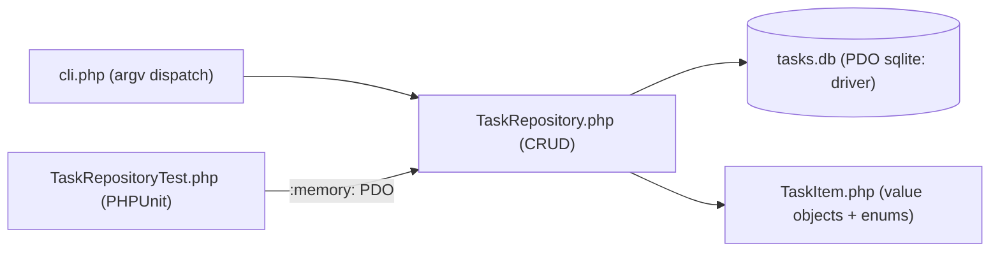

# 22 — Mini Projects

[Back to course overview](../README.md) | [Previous: Solutions](../21-Solutions/README.md)

## Project: Command-Line Task Tracker

A complete, working CLI application that ties together most of the course: PDO/SQLite persistence with named parameterized placeholders (Lesson 16's exact pattern), backed enums with methods (Lesson 11), a custom exception (Lesson 09), immutable value objects via constructor property promotion (`readonly` properties), and a PHPUnit test suite using `#[Test]`/`#[DataProvider]`/`expectException` (Lesson 18's exact pattern, extended to a real multi-file application instead of a single-file example).

### What It Does

A command-line tool that tracks tasks in a local SQLite database. You can add a task (with a priority), list all tasks or filter by status, mark a task done, delete a task by id, and see a pending/done summary — all persisted in a `tasks.db` file so data survives between runs.

### Why This Project

It's small enough to read end-to-end in one sitting, but touches nearly every lesson in this course:

| Concept | Where it shows up |
|---|---|
| Backed enums (11) | `Priority`/`Status` in `TaskItem.php`, with `Priority::label()` implemented via `match` |
| Control flow (05) | `match` expressions throughout `TaskRepository.php` and `cli.php` |
| Error handling (09) | Custom `TaskNotFoundException`; a multi-catch `catch (InvalidArgumentException \| ValueError $e)` in `cli.php` |
| Named/optional parameters (06) | `add(string $title, Priority $priority = Priority::Medium)` |
| Database access (16) | Full CRUD against SQLite via PDO, named (`:id`, `:title`, ...) placeholders throughout, `PDO::ERRMODE_EXCEPTION` set explicitly |
| Immutability (11/12) | `TaskItem`/`TaskStats` are `readonly`-property value objects — `markDone()` returns a *new* `TaskItem` rather than mutating the caller's copy |
| Testing (18) | `TaskRepositoryTest.php` — 15 PHPUnit tests, including a 3-case `#[DataProvider]`, against a fresh `:memory:` SQLite connection per test |
| Best practices (19) | A custom exception instead of a generic one, parameterized SQL only, a thin CLI layer delegating all logic to a testable repository class |

### Project Structure

```
22-Mini-Projects/
├── README.md                          (this file)
└── TaskTracker/
    ├── cli.php                        # CLI entry point (argv parsing + dispatch)
    ├── src/
    │   ├── TaskItem.php                # Priority/Status backed enums, TaskItem + TaskStats value objects
    │   ├── TaskNotFoundException.php   # custom exception
    │   └── TaskRepository.php          # PDO/SQLite CRUD layer
    └── tests/
        └── TaskRepositoryTest.php      # 15 PHPUnit tests against an in-memory DB
```

There is no Composer autoloader here — matching this course's install-free style (Lesson 15 built PSR-4-style autoloading by hand with `spl_autoload_register`; this project instead uses plain `require_once` at the top of each file that needs a dependency, since the file count is small enough that a formal autoloader would add ceremony without adding clarity).

### Architecture



### How to Run It

This project needs the same PHP CLI (8.4.23, with `pdo_sqlite` enabled) used throughout this course — see [01-Setup](../01-Setup/README.md) if `php` isn't already available.

From `22-Mini-Projects/TaskTracker/`:

```bash
php cli.php add "Write project README" --priority high
php cli.php list
php cli.php list --status pending
php cli.php done 1
php cli.php stats
php cli.php delete 3
```

The database file `tasks.db` is created automatically in the current directory on first use (via `CREATE TABLE IF NOT EXISTS`), and is not committed to the repository (`.gitignore` already covers `*.db`/`*.sqlite`/`*.sqlite3`).

### Running the Tests

```bash
cd TaskTracker
# Download PHPUnit's standalone .phar (not committed to the repo), same as Lesson 18:
curl -sSL -o phpunit.phar https://phar.phpunit.de/phpunit-11.phar
php phpunit.phar --testdox tests/TaskRepositoryTest.php
```

`phpunit.phar` is not committed to the repository, same as every other `.phar`/JAR dependency across this repository (`.gitignore` already covers `*.phar`).

The test suite uses a **fresh `:memory:`** SQLite connection per test (built in `setUp()`) — never the real `tasks.db` file — so running tests never touches or resets your actual data. Each test builds its own `PDO('sqlite::memory:')` because SQLite's in-memory database only exists for the lifetime of the single connection that created it; sharing one connection across tests would leak state between them, exactly the discipline Lesson 18's own `setUp()` already establishes.

### Verified Output

This project was actually built, run end-to-end, and tested during course construction with the real PHP 8.4.23 CLI. Real, observed output (not fabricated):

```
$ php cli.php add "Write project README" --priority high
Added task #1: Write project README (priority=High)

$ php cli.php add "Review pull requests" --priority medium
Added task #2: Review pull requests (priority=Medium)

$ php cli.php add "Water the plants" --priority low
Added task #3: Water the plants (priority=Low)

$ php cli.php list
[ ] #1   Write project README           priority=High   created=2026-07-18
[ ] #2   Review pull requests           priority=Medium created=2026-07-18
[ ] #3   Water the plants               priority=Low    created=2026-07-18

$ php cli.php done 1
Marked task #1 as done.

$ php cli.php list --status pending
[ ] #2   Review pull requests           priority=Medium created=2026-07-18
[ ] #3   Water the plants               priority=Low    created=2026-07-18

$ php cli.php list --status done
[x] #1   Write project README           priority=High   created=2026-07-18

$ php cli.php stats
Pending: 2  Done: 1  Total: 3

$ php cli.php delete 3
Deleted task #3.

$ php cli.php list
[x] #1   Write project README           priority=High   created=2026-07-18
[ ] #2   Review pull requests           priority=Medium created=2026-07-18

$ php cli.php done 999
Error: No task found with id 999.

$ php cli.php
Usage:
  php cli.php add <title> [--priority low|medium|high]
  php cli.php list [--status pending|done]
  php cli.php done <id>
  php cli.php delete <id>
  php cli.php stats
```

And the test run:

```
$ php phpunit.phar --testdox tests/TaskRepositoryTest.php
PHPUnit 11.5.56 by Sebastian Bergmann and contributors.

Runtime:       PHP 8.4.23

...............                                                   15 / 15 (100%)

Time: 00:00.051, Memory: 26.00 MB

Task Repository
 ✔ Adding a task defaults to pending and medium priority
 ✔ Adding a task with an empty title throws
 ✔ Adding a task accepts each priority with data set "low priority"
 ✔ Adding a task accepts each priority with data set "medium priority"
 ✔ Adding a task accepts each priority with data set "high priority"
 ✔ All returns tasks in insertion order
 ✔ All can filter by status
 ✔ Find returns the matching task
 ✔ Finding a missing id throws task not found exception
 ✔ Mark done flips status and returns the updated task
 ✔ Mark done on a missing id throws task not found exception
 ✔ Delete removes the task
 ✔ Delete on a missing id throws task not found exception
 ✔ Stats counts pending and done separately
 ✔ Stats on an empty repository is all zero

OK (15 tests, 31 assertions)
```

(Exact timing will vary by machine; pass/fail results should not.)

### Bugs and Gotchas Found While Building This

- **`TaskItem` is immutable by design, which changes what `markDone()` must return.** Because every property is `readonly`, `TaskRepository::markDone()` cannot flip the in-memory object's `status` in place — it issues the `UPDATE`, then calls `find()` again to hand back a freshly-hydrated `TaskItem`. `TaskRepositoryTest::markDoneFlipsStatusAndReturnsTheUpdatedTask()` asserts on this directly: the *original* `TaskItem` the caller already held is still `Status::Pending` after the call, and only the *returned* one is `Status::Done` — a genuine, verified consequence of choosing immutability here, not an incidental detail.
- **`rowsAffected == 0` as the existence check** for `markDone()`/`delete()` avoids a separate `SELECT`-then-`UPDATE`/`DELETE` round trip (which could race under concurrent access) — this project is single-user/single-process, so the race isn't a real risk here, but the pattern (a single statement, checked via `PDOStatement::rowCount()`) is worth using by default regardless, matching the same pattern used in this repository's other language courses' own Task Tracker mini-projects.
- **A real per-class trait-scoped static was NOT needed here** (unlike [20-Exercises](../20-Exercises/README.md)'s Exercise 07 capstone, which uses a `HasId` trait for hand-rolled ids) — `AUTOINCREMENT` on the `id INTEGER PRIMARY KEY` column plus `PDO::lastInsertId()` is simpler and correct for a real SQLite-backed repository, so the trait-based id-generation pattern from the exercises was deliberately left there rather than duplicated here.

### Possible Extensions (Not Built Here — Left as Further Practice)

- A `--due` date field with sorting/filtering by due date.
- Exporting the task list to CSV or JSON (reusing Lesson 10's built-in JSON support).
- A `--priority` filter on `list`, alongside the existing `--status` filter.
- A Composer-based PSR-4 autoloader instead of manual `require_once` calls, once the file count would actually justify it.

## Suggested Next Step

You've completed the PHP course. Revisit [CHEAT-SHEET.md](../CHEAT-SHEET.md) as a reference, or move on to another language course under [01-Languages](../../README.md).
