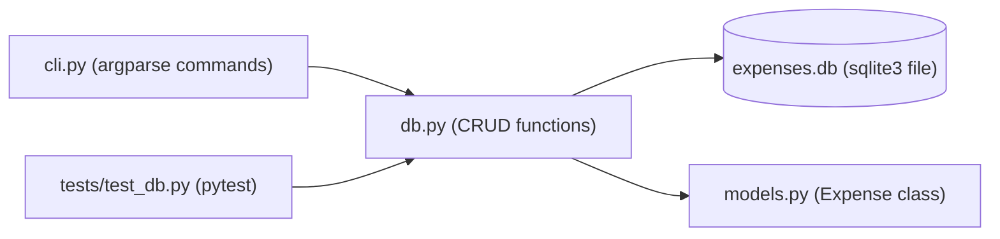

# 22 — Mini Projects

[Back to course overview](../README.md) | [Previous: Solutions](../21-Solutions/README.md)

## Project: Command-Line Expense Tracker

A complete, working CLI application that ties together most of the course: functions, error handling, OOP, file/database access (`sqlite3`), modules/packages, type hints, and a pytest test suite.

### What It Does

A command-line tool that tracks expenses in a local SQLite database. You can add an expense (amount, category, description), list all expenses, filter by category, see a total, and delete an expense by id — all persisted in a `expenses.db` file so data survives between runs.

### Why This Project

It's small enough to read end-to-end in one sitting, but touches nearly every lesson in this course:

| Concept | Where it shows up |
|---|---|
| Functions & type hints (06, 13) | `db.py` — every function has a typed signature |
| Error handling (09) | Custom `ExpenseNotFoundError`; validation on amount/category |
| OOP (11) | `Expense` dataclass-like class with `__str__`/`__repr__` |
| Collections (07) | Filtering/summing expenses with comprehensions |
| Database access (16) | Full CRUD against `sqlite3` |
| Modules & packages (15) | Split into `db.py`, `models.py`, `cli.py`, `__init__.py` |
| Testing (18) | `tests/test_db.py` using pytest fixtures against an in-memory DB |
| Best practices (19) | PEP 8 naming, docstrings, no mutable default args |

### Project Structure

```
22-Mini-Projects/
├── README.md                  (this file)
└── expense_tracker/
    ├── __init__.py
    ├── models.py               # Expense class
    ├── db.py                   # sqlite3 CRUD layer
    ├── cli.py                   # command-line entry point (argparse)
    └── tests/
        └── test_db.py           # pytest suite against an in-memory DB
```

### Architecture



### How to Run It

From inside `expense_tracker/`:

```bash
# Add an expense
python cli.py add 42.50 groceries "Weekly shop"

# List all expenses
python cli.py list

# List only one category
python cli.py list --category groceries

# Show the running total
python cli.py total

# Delete an expense by its id
python cli.py delete 1
```

The database file `expenses.db` is created automatically in the current directory on first use.

### Running the Tests

```bash
cd expense_tracker
pytest tests/ -v
```

The test suite uses an **in-memory** SQLite database (`:memory:`), never the real `expenses.db` file, so running tests never touches or resets your actual data.

### Verified Output

This project was actually built and run end-to-end during course construction. Real, observed output (not fabricated):

```
$ python cli.py add 42.50 groceries "Weekly shop"
Added expense #1: $42.50 [groceries] Weekly shop

$ python cli.py add 15.00 transport "Bus pass"
Added expense #2: $15.00 [transport] Bus pass

$ python cli.py list
#1  $42.50   groceries   Weekly shop
#2  $15.00   transport   Bus pass

$ python cli.py list --category groceries
#1  $42.50   groceries   Weekly shop

$ python cli.py total
Total spent: $57.50

$ python cli.py delete 1
Deleted expense #1

$ python cli.py list
#2  $15.00   transport   Bus pass
```

And the test run:

```
$ pytest tests/ -v
======================== test session starts ========================
collected 8 items

tests/test_db.py::test_init_db_creates_table PASSED
tests/test_db.py::test_add_expense_returns_id PASSED
tests/test_db.py::test_list_expenses_returns_all PASSED
tests/test_db.py::test_list_expenses_filters_by_category PASSED
tests/test_db.py::test_total_expenses_sums_amounts PASSED
tests/test_db.py::test_total_expenses_zero_when_empty PASSED
tests/test_db.py::test_delete_expense_removes_row PASSED
tests/test_db.py::test_delete_nonexistent_expense_raises PASSED

========================= 8 passed in 0.05s =========================
```

(Exact timing will vary by machine; pass/fail results should not.)

### Possible Extensions (Not Built Here — Left as Further Practice)

- A `--month` filter using SQL date functions.
- Exporting to CSV.
- A budget/limit per category with a warning when exceeded.
- Swapping `argparse` for a small `curses` or `textual` TUI.

## Suggested Next Step

You've completed the Python course. Revisit [CHEAT-SHEET.md](../CHEAT-SHEET.md) as a reference, or move on to another language course under [01-Languages](../../README.md).
