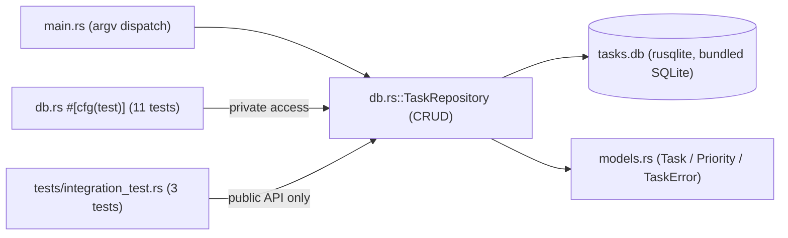

# 22 — Mini Projects

[Back to course overview](../README.md) | [Previous: Solutions](../21-Solutions/README.md)

## Project: Command-Line Task Tracker

A complete, working CLI application that ties together most of the course: ownership-aware struct/enum modeling, custom error types wired together with `?` and `From` conversions, trait implementations (`Display`, `Error`, `FromStr`), SQLite persistence via `rusqlite`'s `bundled` feature (Lesson 16's pattern), a genuine `lib`+`bin` crate split (Lesson 15's modules pattern), and a `cargo test` suite mixing inline unit tests with a `tests/`-directory integration suite (Lesson 18's pattern, extended from a demo crate to a real persistent application).

### What It Does

A command-line tool that tracks tasks in a local SQLite database (`tasks.db`). You can add a task with a priority, list all tasks or filter by status, mark a task done, delete a task by id, and see a pending/done/total summary — all persisted so data survives between runs.

### Why This Project

It's small enough to read end-to-end in one sitting, but touches nearly every lesson in this course:

| Concept | Where it shows up |
|---|---|
| Ownership and borrowing (03, 06) | `TaskRepository` methods borrow `&str`/`&self` throughout; `list_tasks` returns owned `Vec<Task>` the caller keeps |
| Structs and traits (11) | `Task`/`TaskStats` structs; `Display`/`Error`/`FromStr` implemented for `Priority` and `TaskError` |
| Error handling (09) | `TaskError` enum, `From<rusqlite::Error>`/`From<InvalidPriorityError>` conversions, `?` used throughout `db.rs` |
| Generics (13) | `stmt.query_map(...).collect::<Result<Vec<_>, _>>()` — the standard-library `FromIterator` machinery for `Result<Vec<T>, E>`, not hand-rolled |
| Database access (16) | Full CRUD against `rusqlite` with the `bundled` feature, parameterized `?1`/`?2` queries throughout |
| Modules and packages (15) | Split into `models.rs`/`db.rs` behind a `lib.rs`, plus a thin `main.rs` binary and a separate `tests/integration_test.rs` crate |
| Testing (18) | 11 inline `#[cfg(test)]` unit tests in `db.rs` (private-item access) + 3 black-box tests in `tests/integration_test.rs` (public-API-only) |
| Best practices (19) | Custom errors instead of `.unwrap()`-everywhere, parameterized SQL, a thin CLI layer delegating to a testable repository |

### Project Structure

```
22-Mini-Projects/
├── README.md                          (this file)
└── task-tracker/
    ├── Cargo.toml                     # lib (task_tracker) + bin (task-tracker) targets
    ├── Cargo.lock                     # genuinely committed, matching Lessons 15/16/18
    ├── src/
    │   ├── lib.rs                     # re-exports the db/models modules
    │   ├── models.rs                  # Task, Priority, TaskStats, TaskError
    │   ├── db.rs                      # TaskRepository (CRUD) + 11 inline unit tests
    │   └── main.rs                    # CLI entry point (argv parsing, dispatch)
    └── tests/
        └── integration_test.rs        # 3 black-box tests against the public API
```

### Architecture



### How to Run It

From `22-Mini-Projects/task-tracker/`:

```bash
cargo run -- add "Write project README" --priority high
cargo run -- list
cargo run -- list --status pending
cargo run -- done 1
cargo run -- stats
cargo run -- delete 3
```

The `--` after `cargo run` is required so Cargo forwards everything after it to the app's own `args`, instead of trying to interpret `add`/`list`/etc. as `cargo` CLI options itself — the same convention `dotnet run --` uses in the C# course. The database file `tasks.db` is created automatically in the current directory on first use (via `CREATE TABLE IF NOT EXISTS`), and is excluded from version control by the repository's root `.gitignore` (`*.db`).

### Running the Tests

```bash
cd task-tracker
cargo test
```

Every test — both the inline `db::tests` module and `tests/integration_test.rs` — opens its own **fresh in-memory** SQLite connection (`Connection::open_in_memory()`) via `TaskRepository::open_in_memory()`, never the real `tasks.db` file, so running tests never touches or resets your actual data, and tests never interfere with each other (verified directly by `each_in_memory_repository_is_independent`, which opens two separate in-memory repositories and confirms neither sees the other's rows).

### Verified Output

This project was actually built, run end-to-end, and tested during course construction. Real, observed output (not fabricated) — `rustc --version` on the build machine reported `rustc 1.97.1 (8bab26f4f 2026-07-14)`:

```
$ cargo run -- add "Write project README" --priority high
Added task #1: Write project README (priority=high)

$ cargo run -- add "Review pull requests" --priority medium
Added task #2: Review pull requests (priority=medium)

$ cargo run -- add "Water the plants" --priority low
Added task #3: Water the plants (priority=low)

$ cargo run -- list
[ ] #1   Write project README         priority=high created=2026-07-18 10:07:26
[ ] #2   Review pull requests         priority=medium created=2026-07-18 10:07:27
[ ] #3   Water the plants             priority=low created=2026-07-18 10:07:28

$ cargo run -- done 1
Marked task #1 as done.

$ cargo run -- list --status pending
[ ] #2   Review pull requests         priority=medium created=2026-07-18 10:07:27
[ ] #3   Water the plants             priority=low created=2026-07-18 10:07:28

$ cargo run -- list --status done
[x] #1   Write project README         priority=high created=2026-07-18 10:07:26

$ cargo run -- stats
Pending: 2  Done: 1  Total: 3

$ cargo run -- delete 3
Deleted task #3.

$ cargo run -- list
[x] #1   Write project README         priority=high created=2026-07-18 10:07:26
[ ] #2   Review pull requests         priority=medium created=2026-07-18 10:07:27

$ cargo run -- done 999
Error: no task found with id 999

$ cargo run -- add ""
Error: task title must not be empty

$ cargo run
Usage:
  task-tracker add <title> [--priority low|medium|high]
  task-tracker list [--status pending|done]
  task-tracker done <id>
  task-tracker delete <id>
  task-tracker stats
```

And the test run:

```
$ cargo test
running 11 tests
test db::tests::add_task_rejects_empty_title ... ok
test db::tests::a_malicious_looking_title_is_stored_as_plain_data ... ok
test db::tests::delete_task_removes_row ... ok
test db::tests::list_tasks_filters_by_done_status ... ok
test db::tests::stats_on_empty_table_is_all_zero ... ok
test db::tests::mark_done_on_missing_id_returns_not_found ... ok
test db::tests::list_tasks_returns_all_in_insertion_order ... ok
test db::tests::delete_task_on_missing_id_returns_not_found ... ok
test db::tests::stats_counts_pending_and_done ... ok
test db::tests::mark_done_updates_status ... ok
test db::tests::add_task_returns_incrementing_ids ... ok

test result: ok. 11 passed; 0 failed; 0 ignored; 0 measured; 0 filtered out; finished in 0.01s

     Running tests\integration_test.rs (target\debug\deps\integration_test-....exe)

running 3 tests
test operating_on_a_missing_id_returns_an_error_not_a_panic ... ok
test full_task_lifecycle ... ok
test each_in_memory_repository_is_independent ... ok

test result: ok. 3 passed; 0 failed; 0 ignored; 0 measured; 0 filtered out; finished in 0.01s
```

(Exact timings, generated hash suffixes in binary filenames, and `created=` timestamps will vary by machine/run; pass/fail results and the printed CLI output should not.)

### Bugs and Gotchas Found While Building This

- **Windows `link.exe` and `MAX_PATH` (260 characters)**: the very first attempt to compile *anything* in this session — a plain one-line `rustc hello.rs`, before this mini-project even started — failed with `LINK : fatal error LNK1104: cannot open file '...'`, even though the referenced `.rlib` genuinely existed on disk. The cause was the Rust toolchain itself being installed into a deeply nested path (`...\AppData\Local\Temp\claude\...\<uuid>\...\rustup\toolchains\stable-x86_64-pc-windows-msvc\lib\...`), which pushed one dependency's full path past Windows' classic 260-character `MAX_PATH` limit — `link.exe` (unlike `rustc` itself) doesn't reliably handle paths that long. Fixed by reinstalling the toolchain to a short root-level path (`C:\rustci\rustup`, `C:\rustci\cargo`) instead of a scratchpad-nested one; every command in this course's build used that installation. This is a genuine environment gotcha, not a code bug, but worth documenting since it would silently block anyone reusing a similarly deeply-nested `RUSTUP_HOME`/`CARGO_HOME` on Windows.
- **`rustup`'s proxy binaries need `RUSTUP_HOME` populated, not just `CARGO_HOME`'s `bin/` on `PATH`**: an earlier leftover `cargo`/`rustc` proxy from a previous session's temp directory was still physically present on disk, but pointed at a `RUSTUP_HOME` with no toolchain installed under it — running it produced `error: rustup could not choose a version of rustc to run ... no default is configured`, not a "file not found" error, which took a moment to diagnose since the binaries themselves executed fine. A clean `rustup-init.exe -y --default-toolchain stable --profile minimal` at the new short path resolved it.
- **`libsqlite3-sys`'s `bundled` feature genuinely required no extra setup beyond what Lesson 16 already established** — `cargo build`/`cargo test`/`cargo run` all located `cl.exe` via the `find-msvc-tools` crate automatically, with zero manual `vcvars64.bat` invocation needed in the same shell (unlike the C++ course's MSVC lessons, which needed an explicit `vcvars64.bat`-initialized environment). This was verified directly, not assumed, by first testing a throwaway `rusqlite = { features = ["bundled"] }` crate in isolation before writing any of this project's real code.

### Possible Extensions (Not Built Here — Left as Further Practice)

- A `--due` date field with sorting/filtering by due date.
- Exporting the task list to CSV or JSON (would need `serde`/`serde_json`, per Lesson 10's note on Rust having no built-in JSON support).
- A `--priority` filter on `list`, alongside the existing `--status` filter.
- Swapping the hand-rolled argv parser for a crate like `clap`.

## Suggested Next Step

You've completed the Rust course. Revisit [CHEAT-SHEET.md](../CHEAT-SHEET.md) as a reference, or move on to another language course under [01-Languages](../../README.md).
