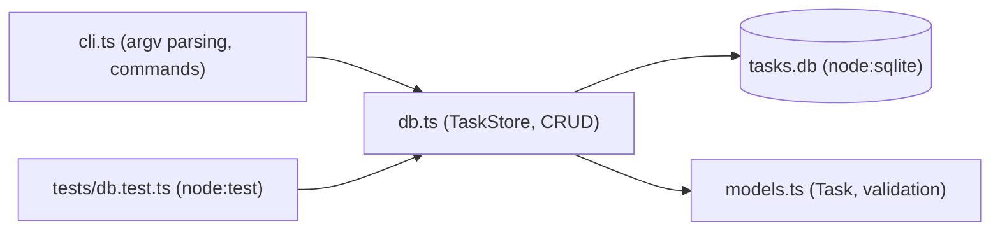

# 22 — Mini Projects

[Back to course overview](../README.md) | [Previous: Solutions](../21-Solutions/README.md)

## Project: Command-Line Task Tracker

A complete, working CLI application that ties together most of the course: generics, error handling, OOP, database access (`node:sqlite`), modules, boundary-validated types, and a `node:test` suite — the TypeScript-idiomatic counterpart to the Python and Java courses' expense trackers, adapted to a task/priority domain instead of an expense/category one.

### What It Does

A command-line tool that tracks tasks (title + priority) in a local SQLite database. You can add a task, list all tasks (optionally filtered by priority or completion status), mark one done, delete one, and see aggregate stats — all persisted in a `tasks.db` file so data survives between runs.

### Why This Project

It's small enough to read end-to-end in one sitting, but touches nearly every lesson in this course:

| Concept | Where it shows up |
|---|---|
| Generics & `keyof`-style precision (13) | `TaskFilter`/`Partial`-shaped query options in `db.ts` |
| Error handling (09) | Custom `TaskNotFoundError`; validation on title/priority |
| OOP (11) | `TaskStore` class encapsulating the database connection |
| Collections & utility types (07) | `Record<Priority, number>` in `TaskStats` |
| Database access (16) | Full CRUD against `node:sqlite`, with the exact "row is `unknown` until validated" pattern |
| Modules (15) | Split into `models.ts`, `db.ts`, `cli.ts`, `tests/db.test.ts` with typed imports/exports |
| Testing (18) | `tests/db.test.ts` using `node:test` against an in-memory (`:memory:`) database |
| Best practices (19) | Boundary validation at every external-data edge (a database row), no `any`, exhaustive-by-construction `Record<Priority, ...>` |

### Project Structure

```
22-Mini-Projects/
├── README.md                  (this file)
└── task-tracker/
    ├── models.ts               # Task/TaskRow types, isPriority/isTaskRow validation, rowToTask
    ├── db.ts                   # TaskStore: node:sqlite CRUD layer, TaskNotFoundError
    ├── cli.ts                  # command-line entry point (hand-rolled argv parsing)
    └── tests/
        └── db.test.ts           # node:test suite against an in-memory TaskStore
```

No `npm install` at all — every piece (`node:sqlite`, `node:test`, `node:assert/strict`) is a Node built-in, matching this course's zero-dependency pattern from Lessons 16 and 18.

### Architecture



### How to Compile and Run It

From inside `task-tracker/`:

```bash
# Compile the app (models.ts + db.ts + cli.ts, all three together so imports resolve)
tsc models.ts db.ts cli.ts --strict --target ES2022 --skipLibCheck --module commonjs --esModuleInterop

# Add a task
node cli.js add "Write lesson" --priority high

# List all tasks
node cli.js list

# List only pending (or only completed) tasks
node cli.js list --pending
node cli.js list --done

# List by priority
node cli.js list --priority high

# Mark a task done, by id
node cli.js done 1

# Delete a task, by id
node cli.js delete 3

# See aggregate stats
node cli.js stats
```

The `--module commonjs --esModuleInterop` pair is required here for the same reason Lesson 15's multi-file example and Lesson 18's test file need it: without `--module commonjs`, `tsc` at `--target ES2022` emits `import`/`export` syntax by default, and Node then either warns about reparsing a typeless `.js` file as an ES module or (in a project with a `package.json` of `"type": "commonjs"`, the Node default) fails outright — compiling three interdependent files as CommonJS keeps everything consistent and warning-free.

The database file `tasks.db` is created automatically in the current directory on first use. Set `TASK_TRACKER_DB=some-other-path.db` to point the CLI at a different file (this is how the verified walkthrough below avoided touching a real `tasks.db`, and it's also how a human tester could try the tool without worrying about leftover state).

### Running the Tests

```bash
cd task-tracker
tsc models.ts db.ts tests/db.test.ts --strict --target ES2022 --skipLibCheck --module commonjs --esModuleInterop
node --test tests/db.test.js
```

Per Lesson 18's documented gotcha, run the **compiled** `tests/db.test.js` explicitly by name, not a bare `node --test` — a bare invocation in a folder containing both `db.test.ts` and `db.test.js` can have Node's test runner attempt to execute the un-transpiled `.ts` source too, via Node's native (still-evolving) TypeScript support, and that path resolves `../db` differently than the compiled CommonJS output does.

The test suite uses an **in-memory** database (`":memory:"`), never the real `tasks.db` file, so running tests never touches or resets your actual data.

### Verified Output

This project was actually built, compiled, and run end-to-end during course construction — including a full walkthrough against a throwaway database (`TASK_TRACKER_DB=walkthrough.db`, deleted afterward). Real, observed output (not fabricated); Node's one-time `ExperimentalWarning: SQLite is an experimental feature` banner on every invocation is omitted below for readability — it appears on every command since `node:sqlite` is still an experimental Node API, but it doesn't affect behavior:

```
$ node cli.js add "Write lesson" --priority high
Added task [ ] #1 (high) Write lesson

$ node cli.js add "Compile examples" --priority medium
Added task [ ] #2 (medium) Compile examples

$ node cli.js add "Review PR" --priority low
Added task [ ] #3 (low) Review PR

$ node cli.js add "Ship it"
Added task [ ] #4 (medium) Ship it

$ node cli.js list
[ ] #1 (high) Write lesson
[ ] #2 (medium) Compile examples
[ ] #3 (low) Review PR
[ ] #4 (medium) Ship it

$ node cli.js list --priority high
[ ] #1 (high) Write lesson

$ node cli.js done 1
Completed [x] #1 (high) Write lesson

$ node cli.js list --pending
[ ] #2 (medium) Compile examples
[ ] #3 (low) Review PR
[ ] #4 (medium) Ship it

$ node cli.js stats
Total: 4  Done: 1  Pending: 3
By priority: low=1 medium=2 high=1

$ node cli.js delete 3
Deleted task #3

$ node cli.js done 999
Error: No task found with id 999

$ node cli.js delete 999
No task #999 to delete

$ node cli.js list
[x] #1 (high) Write lesson
[ ] #2 (medium) Compile examples
[ ] #4 (medium) Ship it

$ node cli.js add "Bad one" --priority urgent
Error: Invalid priority "urgent" -- must be low, medium, or high
```

And the test run:

```
$ node --test tests/db.test.js
✔ addTask returns a task with an assigned id and done=false (6ms)
✔ addTask rejects a title that's empty or only whitespace (1.8ms)
✔ listTasks returns all tasks ordered by id (1.2ms)
✔ listTasks filters by priority (3.3ms)
✔ listTasks filters by done status (1.6ms)
✔ completeTask marks a task done and returns the updated task (1.1ms)
✔ completeTask on a nonexistent id throws TaskNotFoundError (13.6ms)
✔ deleteTask removes a task and reports success (1.8ms)
✔ deleteTask on a nonexistent id returns false rather than throwing (1.5ms)
✔ stats aggregates totals and per-priority counts correctly (2.5ms)
ℹ tests 10
ℹ suites 0
ℹ pass 10
ℹ fail 0
ℹ cancelled 0
ℹ skipped 0
ℹ todo 0
```

(Exact timings will vary by machine; pass/fail results should not.)

### A Real Gotcha Found While Building This

`node:sqlite`'s `StatementSync.run()` returns `{ changes, lastInsertRowid }` typed as `number | bigint` — SQLite can report rowids beyond `Number.MAX_SAFE_INTEGER`, so the Node types allow for a `bigint` result even though any realistic run of this app never gets close to that range. `completeTask`'s not-found check was originally written as `if (result.changes === 0)`; under `--strict`, `bigint === number` compiles (both are comparable primitives under `===`), so this looked fine, but the actual runtime value in testing came back as a `number`, not a `bigint`, in this Node version — meaning the check happened to work here but was one Node/SQLite-version behavior change away from silently never matching (`0n === 0` is `false`, so a `bigint 0n` would have made every `completeTask`/`deleteTask` call falsely believe it succeeded). Wrapping both comparisons in `Number(result.changes)` closes that gap explicitly rather than relying on which primitive type this particular Node build happens to return.

### Possible Extensions (Not Built Here — Left as Further Practice)

- A `--due <date>` field with SQL date-range filtering.
- Exporting tasks to JSON or CSV.
- A `--sort` flag (by priority, by id, by title).
- Swapping hand-rolled argv parsing for a small typed CLI-argument-parsing library.

## Suggested Next Step

You've completed the TypeScript course's exercises, solutions, and mini-project. Revisit [CHEAT-SHEET.md](../CHEAT-SHEET.md) as a reference, or move on to another language course under [01-Languages](../../README.md).
