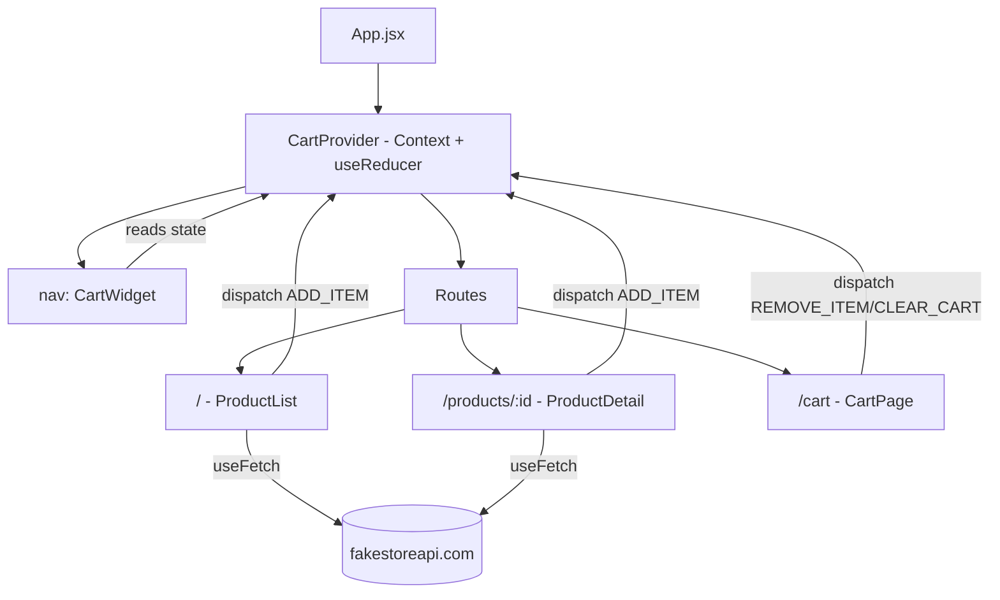

# Mini-Project — A Small Product Store

[Back to 03-Frontend-Development](../README.md)

## Overview

A small but complete React app combining every concept from Lessons 01–07: components/props, hooks, controlled forms, client-side routing, real live-API data fetching, Context+reducer state management, and tests — built against **fakestoreapi.com**, a real, free, public product API (the same "hit a real live API" convention already used throughout this repository, e.g., `jsonplaceholder.typicode.com` in Lesson 05 and elsewhere).

- Browse a product catalog (`/`) — fetched live from `fakestoreapi.com`.
- View a single product's detail page (`/products/:id`) — a dynamic route.
- Add products to a cart from either page — cart state lives in Context+reducer (Lesson 06's pattern), shared across the nav's cart widget and both pages, surviving actual client-side route changes.
- View/manage the cart (`/cart`) — remove items, clear the cart.

## Architecture



`CartProvider` wraps `<Routes>` in `App.jsx`, not any individual page — this is what lets cart state survive a real navigation from `/` to `/products/1` to `/cart`, rather than resetting on every route change.

## A Real Bug Found and Fixed During Manual Browser Verification

While verifying this project in an actual browser (not just the mocked test suite), `ProductList` genuinely crashed:

```
TypeError: Cannot read properties of null (reading 'map')
  at ProductList src/pages/ProductList.jsx:14:16
```

**Root cause**: `useFetch` (reused unmodified from Lesson 05) has a real gap in React 19's StrictMode dev behavior. StrictMode intentionally double-invokes effects in development: it mounts the effect, immediately runs its cleanup (which calls `controller.abort()` on the first fetch), then mounts the effect again for the fetch that actually completes. The **first** (aborted) fetch's `.catch` correctly recognized the `AbortError` and skipped setting `error` — but its `.finally` still unconditionally ran `setLoading(false)`, before the *second* fetch had resolved. That left the component rendering with `loading=false`, `error=null`, and `data` still `null` — and `ProductList` called `products.map(...)` unconditionally once `loading` was false, with no guard for `data` still being `null`.

**Fix**: guard the `.finally` with `if (!controller.signal.aborted) setLoading(false)`, so only the fetch that's actually still alive gets to flip `loading` to `false`. Applied to **both** `Mini-Project/src/useFetch.js` and, since it has the identical latent bug, `05-Routing-and-Data-Fetching/src/useFetch.js` — see the comment at the fix site in both files. All of Lesson 05's own mocked tests still pass unchanged after the fix (mocked `fetch` never triggers StrictMode's abort race, which is exactly why the mocked tests never caught this — a real, honest limitation of mock-only testing, worth noting rather than glossing over).

## Files

- [`src/useFetch.js`](src/useFetch.js) — the fixed hook.
- [`src/cart/cartReducer.js`](src/cart/cartReducer.js), [`src/cart/CartContext.jsx`](src/cart/CartContext.jsx) — cart state.
- [`src/pages/ProductList.jsx`](src/pages/ProductList.jsx), [`src/pages/ProductDetail.jsx`](src/pages/ProductDetail.jsx), [`src/pages/CartPage.jsx`](src/pages/CartPage.jsx) — the three routes.
- [`src/components/CartWidget.jsx`](src/components/CartWidget.jsx) — the nav's live cart summary.
- [`src/cart/cartReducer.test.js`](src/cart/cartReducer.test.js), [`src/App.test.jsx`](src/App.test.jsx) — 10 tests total.

## How to Run

```bash
cd 03-Frontend-Development/Mini-Project
npm install
npm test           # mocked, fast unit + integration tests
npm run dev         # http://localhost:5173 (or next free port) — hits the REAL live API
npm run build        # production build
```

## Verified Behavior (Real Output)

**Mocked test suite:**
```
$ npx vitest run

 Test Files  2 passed (2)
      Tests  10 passed (10)
```

Specifically: the cart widget starts at `Cart (0) — $0.00`; adding a product from the **list** page updates it; adding from the **detail** page (a completely different route/component) updates the *same* shared cart; the cart page shows an empty-state message with nothing added; and a full flow — add on the list page, click through to `/cart` via the real rendered `<Link>`, see the item and correct total, remove it, see the empty state return — passes end to end.

**Real production build:**
```
$ npm run build
✓ 31 modules transformed.
dist/assets/index-HDP3TIsA.js   235.61 kB │ gzip: 75.45 kB
✓ built in 470ms
```

**A genuine, live, headless-Chromium (Playwright) run against the real running app and the real fakestoreapi.com API** — not mocked, not simulated:
```
Home page loaded. Cart widget: Cart (0) — $0.00
After adding first product, cart widget: Cart (1) — $109.95
Navigated to product detail for: Fjallraven - Foldsack No. 1 Backpack, Fits 15 Laptops
Cart page body text: ...Fjallraven - Foldsack No. 1 Backpack, Fits 15 Laptops × 1 — $109.95 Remove Total: $109.95 Clear cart
```

This run is also what surfaced the StrictMode/`useFetch` bug above — the mocked test suite alone never would have caught it, which is itself worth taking away from this project: mocked tests and one real, live, manually-driven run each catch different classes of bug.

## Suggested Improvements

- Persist the cart to `localStorage` (Lesson 09's Beginner-project pattern) so it survives a page reload.
- Add quantity +/- controls on the cart page, rather than only add-one/remove-entirely.
- Add a loading skeleton instead of a plain "Loading products..." text.
- Wrap the whole app in an error boundary (React's own suggestion, seen directly in this project's own console output while the bug above was still present).

**Previous lesson:** [09-Other-Frameworks](../09-Other-Frameworks/README.md)
