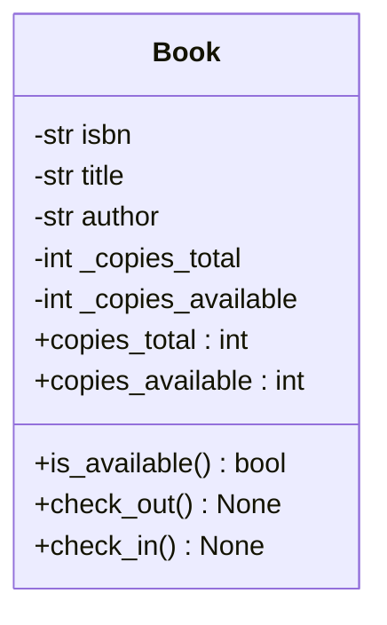
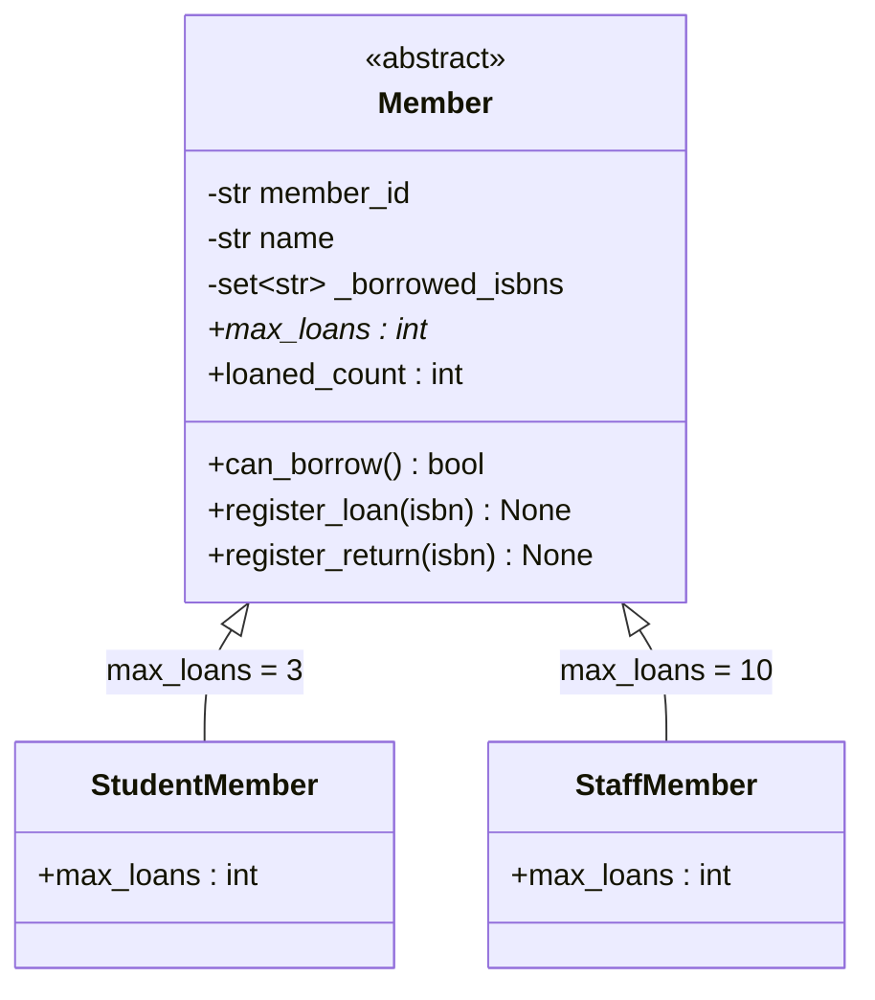
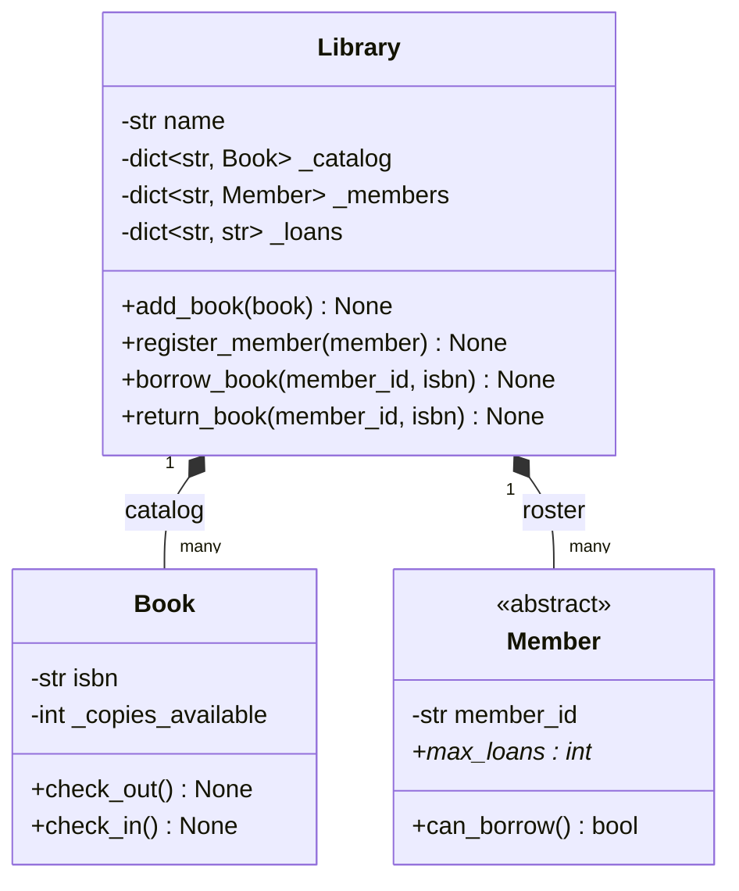
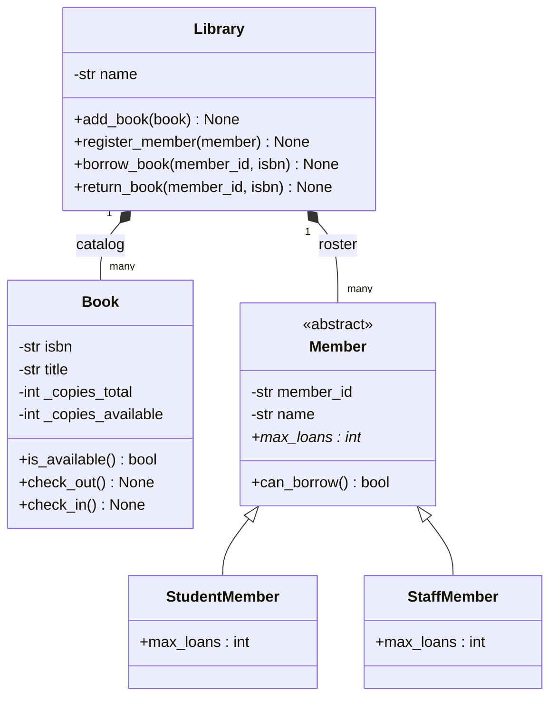

# Diagrams — Object-Oriented Programming

[Back to module overview](../README.md) | [Mini-Project](../Mini-Project/README.md)

Class diagrams for the [Mini-Project](../Mini-Project/README.md)'s Library Management System, using [Mermaid](https://mermaid.js.org/syntax/classDiagram.html) `classDiagram` syntax. These describe the actual classes in `Mini-Project/book.py`, `member.py`, and `library.py` — not generic textbook examples — so you can read a diagram, then open the matching source file to see it implemented.

## 1. A Basic Class: `Book`

Encapsulation in diagram form: `_copies_total` and `_copies_available` are private-by-convention fields, and every interaction goes through the public methods/properties — no diagrammed field is mutated directly from outside the class.

## 2. Inheritance Hierarchy: `Member`, `StudentMember`, `StaffMember`

`Member` is abstract (it declares `max_loans` but supplies no default value — there isn't a sensible one). `StudentMember` and `StaffMember` each override `max_loans` with their own policy; this is the polymorphism pillar — `Library.borrow_book()` calls `member.can_borrow()` without ever checking which subclass it has.

## 3. Composition: `Library` Has Books and Members

`Library` does not inherit from `Book` or `Member` — a library isn't a kind of book or a kind of member. It *holds collections of both* and coordinates between them, which is exactly what composition (filled diamond, "has-a") means as opposed to inheritance (hollow triangle, "is-a") in diagram #2 above.

## 4. Full Picture: All Relationships Together

Combines all three: `Library` composes `Book` and `Member`; `Member` is specialized by inheritance into `StudentMember`/`StaffMember`.

## Reading These Diagrams

- `+` = public member, `-` = private/protected (Python's underscore-prefix convention, not true enforcement — see [Lesson 02](../02-Encapsulation/README.md)).
- `int*` denotes an abstract member (Mermaid's convention, mirroring UML) — `max_loans` has no body on `Member` itself.
- A hollow-triangle arrow (`<|--`) is inheritance ("is-a"); a filled-diamond arrow (`*--`) is composition ("has-a"). Getting this distinction right in a design is exactly what [Lesson 06](../06-Composition-vs-Inheritance/README.md) is about.
