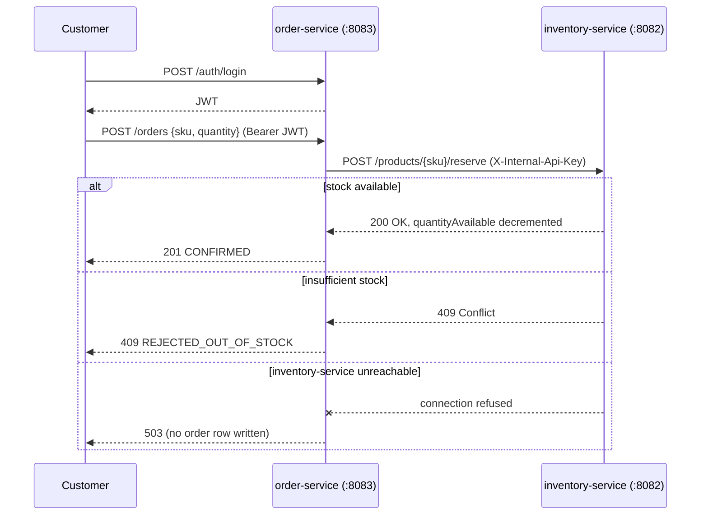
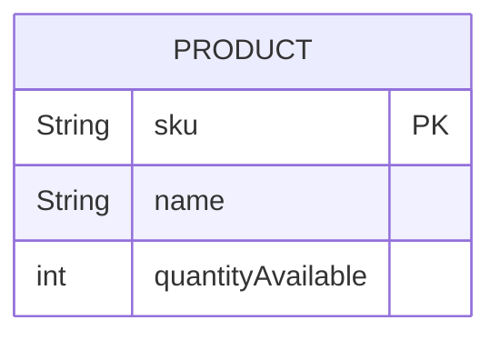
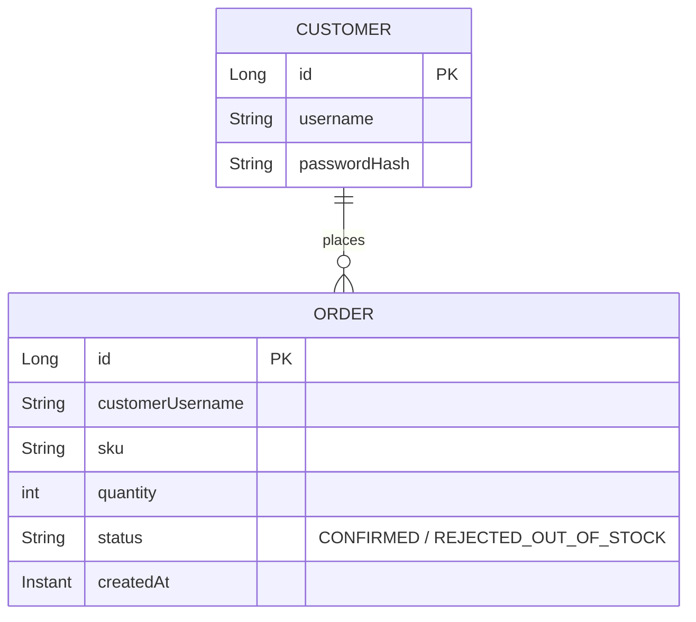

# Distributed Order Processing System

Two genuinely separate Spring Boot services — **order-service** and **inventory-service** — running as independent processes on different ports, communicating only over real HTTP, with no shared database and no shared memory. This is the "Advanced" deliverable for `22-Projects`, combining [13-Software-Architecture](../../13-Software-Architecture/README.md) (microservices, distributed-systems trade-offs), [07-Databases](../../07-Databases/README.md) (per-service relational persistence, local transactions), and [16-Security](../../16-Security/README.md) (customer JWT auth *and* service-to-service API-key auth).

Unlike the Intermediate project's single monolith, the point here is what changes when a "single business transaction" (place an order) actually spans two independently-deployable services that can each be up, slow, or completely unreachable — and to prove, live, that this implementation makes a deliberate, documented choice about what happens in each case.

## Table of Contents

- [Architecture](#architecture)
- [The Core Design Decision: CP over AP](#the-core-design-decision-cp-over-ap)
- [Data Model](#data-model)
- [API Endpoints](#api-endpoints)
- [How to Run](#how-to-run)
- [Verified Behavior (Real Output)](#verified-behavior-real-output)
- [Security Notes](#security-notes)
- [Suggested Improvements](#suggested-improvements)

## Architecture



Each service owns its own H2 database (`orderservice` vs. `inventory`) — there is no shared schema, no shared transaction, and no way for one service to directly query the other's tables. The only contract between them is the HTTP API.

## The Core Design Decision: CP over AP

This is the same CAP-theorem trade-off already demonstrated with two raw HTTP servers in [20-Computer-Science-Fundamentals/04-CAP-Theorem-and-Distributed-Systems](../../../20-Computer-Science-Fundamentals/04-CAP-Theorem-and-Distributed-Systems/README.md), applied here to a realistic feature instead of a toy key-value store.

When `order-service` cannot reach `inventory-service` at all (a genuine network partition — verified below by actually killing the process, not simulating it), it has two options:

- **AP (Availability):** accept the order anyway, optimistically, and reconcile later.
- **CP (Consistency):** refuse the order with `503`, because it cannot verify real stock exists.

This implementation deliberately chooses **CP** — `OrderController` returns `503` and writes **no** `Order` row at all when `InventoryClient.reserve()` throws a connection error (`ReservationResult.ServiceUnavailable`). The reasoning: an order a customer believes is confirmed, for a product that turns out to be out of stock, is a worse failure mode for a library-style e-commerce flow than a temporarily-unavailable "place order" button. This is a judgment call, not a law — a flash-sale system might reasonably choose AP instead and reconcile via a saga/compensation flow.

**A related, honestly-disclosed limitation:** even in the success path, this is not a real distributed transaction. `order-service` calls `inventory-service` to reserve stock *first*, then commits the local `Order` row *second*. If the reservation succeeds but the local database write then fails (e.g., disk full), the reserved stock is never released — a genuine, uncompensated inconsistency window. A production system would need a saga pattern with a compensating `release` call on order-write failure, or a proper distributed-transaction/outbox mechanism. `InventoryClient.release()` exists and is wired for the return/cancel path but is not yet invoked as an automatic compensator for this specific failure window — documented here rather than silently glossed over.

## Data Model

**inventory-service** — single table:



**order-service** — two tables, no foreign key to `PRODUCT` (it lives in a different database entirely; `sku` is just a string):



## API Endpoints

**inventory-service** (`:8082`)

| Method | Path                        | Auth                    | Description |
|--------|-----------------------------|--------------------------|--------------|
| GET    | `/products`                 | none                    | List all products. |
| GET    | `/products/{sku}`           | none                    | Get one product. |
| POST   | `/products/{sku}/reserve`   | `X-Internal-Api-Key`   | Decrement stock; `409` if insufficient. |
| POST   | `/products/{sku}/release`   | `X-Internal-Api-Key`   | Increment stock back (compensating action). |

**order-service** (`:8083`)

| Method | Path                          | Auth              | Description |
|--------|-------------------------------|--------------------|--------------|
| POST   | `/auth/login`                 | none               | Returns a JWT. |
| POST   | `/orders`                      | any authenticated | Place an order (`sku`, `quantity`). `201` confirmed, `409` out of stock, `503` inventory unreachable. |
| GET    | `/orders/{id}`                 | any authenticated | Get one order. |
| GET    | `/customers/{username}/orders` | any authenticated | A customer's order history. |

Seeded accounts: `bob` / `bob123` on order-service. Seeded products on inventory-service: `SKU-KEYBOARD` (5 in stock), `SKU-MOUSE` (0 in stock — deliberately, to demonstrate rejection), `SKU-MONITOR` (2 in stock).

## How to Run

Start **both** services (order they start in doesn't matter, but `inventory-service` should be up before placing orders):

```bash
cd 22-Projects/Advanced/Distributed-Order-Processing-System/inventory-service
mvn spring-boot:run
# in a second terminal:
cd 22-Projects/Advanced/Distributed-Order-Processing-System/order-service
mvn spring-boot:run
```

Both use H2 in-memory databases — data resets on every restart, and `inventory-service` restarting mid-demo resets stock counts back to their seeded values (this is expected, and was observed directly during verification below).

## Verified Behavior (Real Output)

Every claim below was checked against two actually-running processes over real HTTP and real `taskkill`, not simulated.

**A confirmed order actually decrements stock in the other service:**
```
POST :8083/orders {"sku":"SKU-KEYBOARD","quantity":2} → 201 CONFIRMED
GET  :8082/products/SKU-KEYBOARD → quantityAvailable: 5 → 3
```

**Out-of-stock is rejected, and the rejection itself is recorded as an order:**
```
POST :8083/orders {"sku":"SKU-MOUSE","quantity":1} → 409
{"error":"Insufficient stock","available":0,"order":{...,"status":"REJECTED_OUT_OF_STOCK"}}
```

**Service-to-service auth is real** — inventory-service's mutating endpoints reject a caller with no API key:
```
POST :8082/products/SKU-KEYBOARD/reserve (no X-Internal-Api-Key header) → 403
```

**The partition demo — the actual point of this project:**
```
$ taskkill /PID <inventory-service PID> /F      # a real, hard process kill, not a mock
SUCCESS

POST :8083/orders {"sku":"SKU-MONITOR","quantity":1} → 503
{"error":"Inventory service unavailable -- cannot confirm order without verifying stock"}

GET :8083/customers/bob/orders → unchanged; no phantom order was written for the failed attempt
```

**Recovery after the partition heals:**
```
$ mvn spring-boot:run   # inventory-service restarted fresh
POST :8083/orders {"sku":"SKU-MONITOR","quantity":1} → 201 CONFIRMED
```

## Security Notes

- Customer-facing auth (`order-service`) uses the same verified JWT pattern as [04-Backend-Development](../../../04-Backend-Development/README.md) and the Intermediate project: BCrypt-hashed passwords, stateless JWT, no server-side session.
- Service-to-service auth (`inventory-service`) intentionally uses a much simpler shared-secret header rather than full OAuth2/mTLS — proportionate to a same-trust-boundary internal call, and explicitly not exposed to end users (only `GET /products/**` is public; mutating endpoints require the key).
- Both signing/shared secrets are hardcoded for this self-contained lesson — a real deployment must externalize them (environment variables, a secrets manager), exactly as flagged in the Intermediate project.

## Suggested Improvements

- Implement the missing compensating `release()` call for the order-write-fails-after-reservation-succeeds window described above.
- Replace the direct HTTP call with an async message queue (e.g., a lesson extension into genuine event-driven architecture) so `order-service` doesn't block waiting on `inventory-service`.
- Add a circuit breaker (e.g., Resilience4j) around `InventoryClient` so repeated failures short-circuit instead of waiting for a fresh TCP-connect timeout each time.
- Persist both databases (PostgreSQL) so state survives restarts, rather than resetting on every run.

**Previous project:** [Intermediate/Library-Management-System](../../Intermediate/Library-Management-System/README.md)
