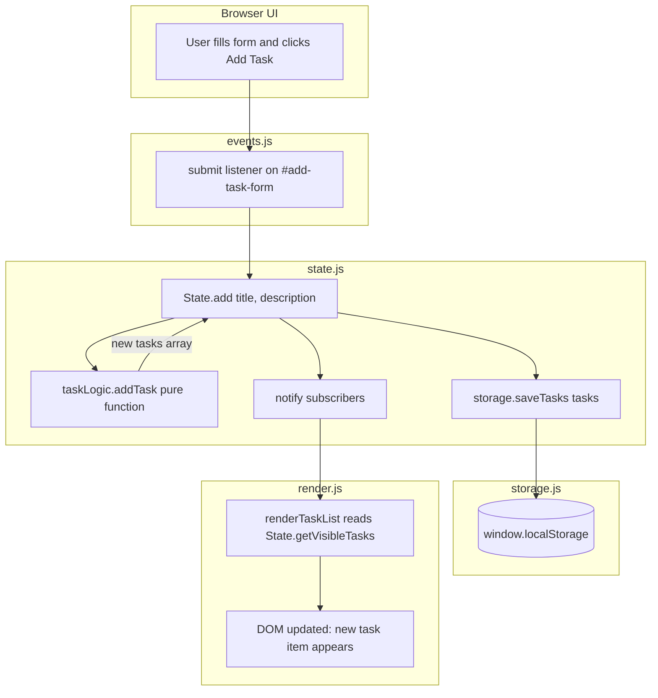
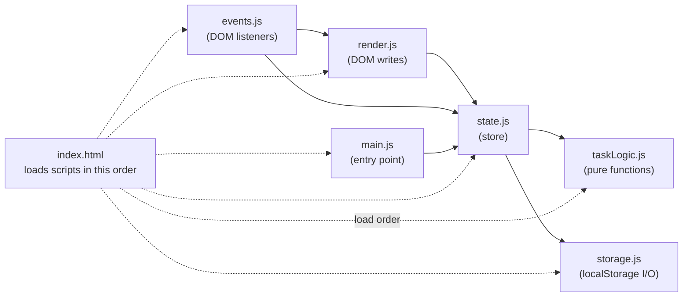
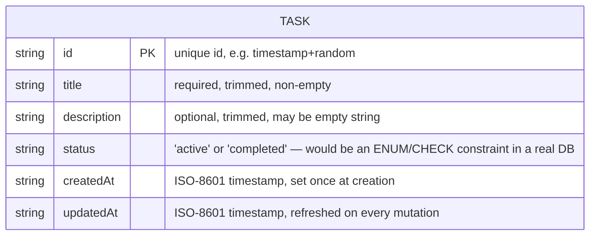

# Architecture

## Component / Data Flow

Even though this is a small vanilla-JS app, it's organized into single-responsibility modules so each piece stays independently understandable (and, for `taskLogic.js` and `storage.js`, independently testable — see [`TESTING.md`](TESTING.md)).

- **`taskLogic.js`** — pure functions only (`createTask`, `addTask`, `updateTask`, `deleteTask`, `toggleTaskStatus`, `filterTasks`). Takes a plain task array in, returns a new plain task array out. No DOM, no `localStorage`, no side effects.
- **`storage.js`** — the only file that touches `window.localStorage`. Exposes `loadTasks()` / `saveTasks(tasks)`.
- **`state.js`** — the in-memory store. Holds the current task array and active filter, calls into `taskLogic.js` for mutations, calls `storage.js` to persist after every mutation, and notifies subscribers so the UI can re-render.
- **`render.js`** — all DOM-writing code. Reads from `state.js`, builds/replaces DOM nodes. Never mutates state directly.
- **`events.js`** — all `addEventListener` calls. Translates user actions (clicks, form submits, checkbox toggles) into calls on `state.js`, and subscribes `render.js` to state changes.
- **`main.js`** — startup landmark / entry point.

### Data flow for a typical action (e.g. "add task")

### Module dependency graph

**Why this shape:** `state.js` is the only module that knows both "how to mutate tasks" (`taskLogic.js`) and "how to persist them" (`storage.js`). `render.js` and `events.js` only ever talk to `state.js` — never to `taskLogic.js` or `storage.js` directly. That means the persistence mechanism (currently `localStorage`) can be swapped for a real backend API by rewriting `storage.js` alone; `state.js`'s public interface (`add`, `update`, `remove`, `toggleStatus`, `getTasks`, `subscribe`, ...) would stay the same, so `render.js` and `events.js` would not need to change at all. The one caveat: today's `storage.js` calls are synchronous (`localStorage` is synchronous), while a real API would be asynchronous (`fetch` returns a Promise) — `state.js`'s `commit()` would need to become `async` and callers would need to handle in-flight/error states, but the module boundaries themselves would not move.

## Task Data Model

The task shape below is what `taskLogic.createTask()` produces and what `storage.js` serializes to `localStorage` as JSON. It's deliberately shaped the way a real backend's `tasks` table would be — same field names, same types — so that migrating from `localStorage` to a real database later is a rename-free exercise, not a redesign.

In a real backend, this would typically also gain a `user_id` foreign key (to scope tasks per authenticated user) and the `id` would be a database-generated UUID or auto-increment integer rather than a client-generated string — see the Security Note in [`README.md`](README.md#security-note) for why client-side data has no real access control today.
