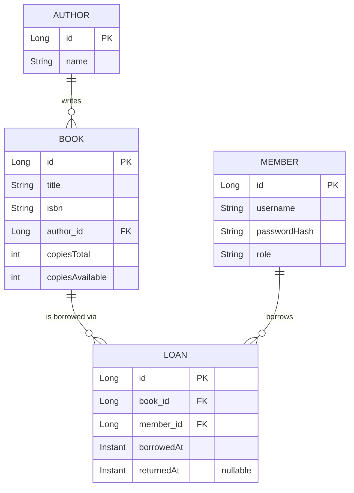

# Library Management System

A complete, runnable **library lending backend** built with Spring Boot 4.1.0, Spring Data JPA, Spring Security, and JWT authentication. It models the real-world core of a library: authors, books with limited copies, members, and loans — with the central business rule (**you cannot borrow a book with zero copies available**) enforced server-side and verified live.

This project is the "Intermediate" deliverable for `22-Projects`, combining patterns already verified elsewhere in this repository: [04-Backend-Development](../../../04-Backend-Development/README.md) (REST + JWT), [07-Databases](../../../07-Databases/README.md) (relational modeling, transactions), and [16-Security](../../../16-Security/README.md) (password hashing, role-based authorization).

## Table of Contents

- [Overview](#overview)
- [Requirements](#requirements)
- [User Stories](#user-stories)
- [Technology Stack](#technology-stack)
- [Data Model (ER Diagram)](#data-model-er-diagram)
- [Folder Structure](#folder-structure)
- [API Endpoints](#api-endpoints)
- [How to Run](#how-to-run)
- [Verified Behavior (Real Output)](#verified-behavior-real-output)
- [Security Notes](#security-notes)
- [Suggested Improvements](#suggested-improvements)

## Overview

A librarian can add books (each linked to an author, with a total copy count). Any visitor can browse the catalog. A registered member can log in, borrow an available copy, return it, and view their own loan history. The system tracks `copiesAvailable` per book and rejects a borrow attempt once it reaches zero — the one rule this project exists to demonstrate correctly, end to end, under real HTTP requests.

## Requirements

**Functional requirements**

- Anyone can list books and view a single book's details (`GET /books`, `GET /books/{id}`) without logging in.
- Only an authenticated **LIBRARIAN** can add a new book (`POST /books`).
- Any authenticated member can borrow a book (`POST /loans`) — this must fail with `409 Conflict` if `copiesAvailable` is already `0`.
- A member can return a borrowed book (`POST /loans/{id}/return`) — this must fail with `409 Conflict` if the loan was already returned.
- A member can view their own loan history (`GET /members/{id}/loans`).
- Login (`POST /auth/login`) issues a signed JWT carrying the member's username and role.

**Non-functional requirements**

- **Stateless authentication.** No server-side session store — every request re-authenticates from its own JWT, verified with [04-Backend-Development](../../../04-Backend-Development/README.md)'s exact JWT pattern (`io.jsonwebtoken` 0.12.6).
- **Passwords are never stored in plaintext.** BCrypt via Spring Security's `PasswordEncoder`.
- **Role-based authorization**, not just authentication — `@PreAuthorize("hasRole('LIBRARIAN')")` gates book creation.
- **Data consistency under concurrent-looking operations**: borrowing decrements `copiesAvailable` and returning increments it, both inside a single `@Transactional` method alongside the `Loan` row write.

## User Stories

- As a visitor, I want to browse the book catalog without an account, so I can see what's available before joining.
- As a librarian, I want to add new books tied to an author with a copy count, so the catalog reflects what's physically on the shelf.
- As a member, I want to borrow an available book, so I can read it.
- As a member, I want to be told clearly (not silently) when a book has no copies left, so I know to try another book or wait.
- As a member, I want to return a book, so the copy becomes available to others again.
- As a member, I want to see my own borrowing history, so I can track what I currently have out.

## Technology Stack

| Layer          | Choice                                   | Why |
|----------------|-------------------------------------------|-----|
| Framework      | Spring Boot 4.1.0                          | Matches the current version already verified working in [04-Backend-Development](../../../04-Backend-Development/README.md); Spring Initializr's own current default. |
| Persistence    | Spring Data JPA + Hibernate                | Declarative repositories (`JpaRepository`) over hand-written SQL, consistent with [07-Databases](../../../07-Databases/README.md)'s ORM lesson. |
| Database       | H2 (in-memory)                             | Zero external setup for a self-contained, runnable project; schema is created fresh (`ddl-auto=update`) and seeded on every start. |
| Security       | Spring Security + JWT (`io.jsonwebtoken` 0.12.6) | Stateless, verified pattern reused verbatim from `04-Backend-Development/04-Authentication-and-Authorization`. |
| Build tool     | Maven                                      | Matches every other Spring Boot project in this repository. |

## Data Model (ER Diagram)



`copiesAvailable` is denormalized onto `Book` (rather than computed by counting open loans) so a borrow attempt is a single, cheap, transactional check-and-decrement — the same trade-off a real high-traffic catalog would make.

## Folder Structure

```
Library-Management-System/
├── pom.xml
├── src/main/java/com/example/library/
│   ├── LibraryApplication.java
│   ├── DataSeeder.java          # CommandLineRunner: seeds authors, books, members on startup
│   ├── model/                   # Author, Book, Member, Role, Loan (JPA entities)
│   ├── repo/                    # AuthorRepository, BookRepository, MemberRepository, LoanRepository
│   ├── security/                # JwtService, JwtAuthFilter, SecurityConfig, AuthController, LoginRequest
│   ├── web/                     # BookController, LoanController
│   └── dto/                     # BookResponse, CreateBookRequest, LoanResponse, BorrowRequest
├── src/main/resources/
│   └── application.properties
└── README.md
```

## API Endpoints

| Method | Path                     | Auth              | Description |
|--------|--------------------------|--------------------|--------------|
| POST   | `/auth/login`            | none               | Returns a JWT for a valid username/password. |
| GET    | `/books`                 | none               | List all books. |
| GET    | `/books/{id}`            | none               | Get one book. |
| POST   | `/books`                 | LIBRARIAN          | Create a book (`title`, `isbn`, `authorId`, `copiesTotal`). |
| POST   | `/loans`                 | any authenticated  | Borrow a book (`bookId`). `409` if no copies available. |
| POST   | `/loans/{id}/return`     | any authenticated  | Return a loan. `409` if already returned. |
| GET    | `/members/{id}/loans`    | any authenticated  | List a member's loan history. |

Seeded accounts: `alice` / `alice123` (MEMBER), `libby` / `libby123` (LIBRARIAN).

## How to Run

```bash
cd 22-Projects/Intermediate/Library-Management-System
mvn spring-boot:run
```

The server starts on **port 8081** (`server.port` in `application.properties` — changed from Spring Boot's default 8080 because this environment already has an unrelated service bound to 8080; adjust freely if yours doesn't). The H2 console is available at `http://localhost:8081/h2-console` (JDBC URL `jdbc:h2:mem:library`, user `sa`, empty password).

## Verified Behavior (Real Output)

Every rule below was checked against the actually-running server via real `curl` requests, not asserted from reading the code.

**Public catalog read, no auth needed:**
```
GET /books → 200
[{"id":1,"title":"1984",...,"copiesAvailable":2}, {"id":2,"title":"Animal Farm",...,"copiesAvailable":0}, ...]
```

**Role enforcement — a MEMBER cannot create a book:**
```
POST /books  (Authorization: Bearer <alice's MEMBER token>)
→ 403
```

**A LIBRARIAN can:**
```
POST /books (Authorization: Bearer <libby's LIBRARIAN token>)
→ 201 {"id":4,"title":"Brave New World",...}
```

**The central rule — borrowing a book with zero copies is rejected:**
```
POST /loans {"bookId":2}   (Animal Farm, copiesAvailable=0)
→ 409 {"error":"No copies available for this book"}
```

**Borrowing an available book succeeds and decrements the count:**
```
POST /loans {"bookId":1}   (1984, copiesAvailable=2)
→ 201 {"id":1,"bookId":1,"bookTitle":"1984","memberId":1,"borrowedAt":"...","returnedAt":null}
GET /books/1 → copiesAvailable now 1
```

**Returning increments the count back, and returning twice is rejected:**
```
POST /loans/1/return → 200 {"id":1,...,"returnedAt":"..."}
GET /books/1 → copiesAvailable back to 2
POST /loans/1/return (again) → 409 {"error":"Loan already returned"}
```

**Loan history is itself an authenticated endpoint** — `GET /members/1/loans` returns `403` with no token, and the correct loan list once a valid token is attached.

**Unauthenticated borrow attempt is rejected:**
```
POST /loans {"bookId":1}   (no Authorization header)
→ 403
```

## Security Notes

- Passwords are BCrypt-hashed (`PasswordEncoder`), never stored or compared in plaintext.
- The JWT signing key is hardcoded in `JwtService` — acceptable only for a self-contained lesson; a real deployment must load it from an environment variable or secrets manager (the same caveat documented in `04-Backend-Development`).
- CSRF protection is disabled deliberately: this is a stateless, token-based API with no cookie-based session, so CSRF (which targets cookie auth) doesn't apply — see `SecurityConfig`'s comment.
- The H2 console is left reachable at `/h2-console` for inspection during development; a production build would remove it entirely.

## Suggested Improvements

- Pagination and search/filtering on `GET /books`.
- A `MemberController` for self-service registration (currently members are seed-data only).
- Loan due dates and overdue tracking.
- Replace the H2 in-memory database with a persistent one (e.g. PostgreSQL, following [07-Databases](../../../07-Databases/README.md)'s patterns) so data survives a restart.
- Refresh tokens, so a member isn't forced to re-login every hour.

**Previous project:** [Beginner/Task-Management-CRUD](../../Beginner/Task-Management-CRUD/README.md)
